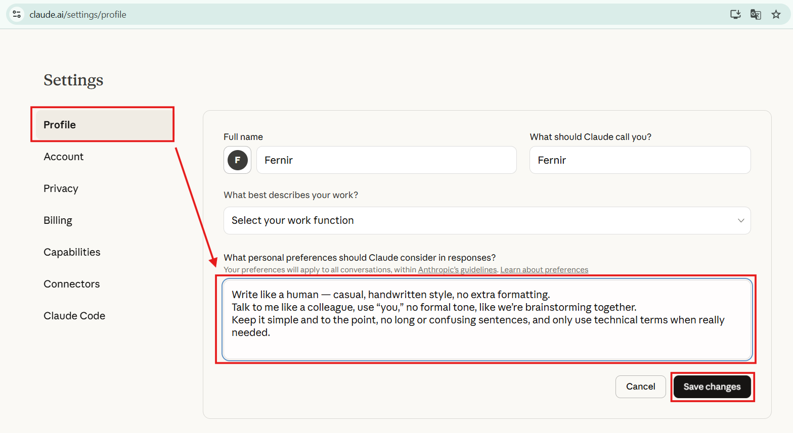
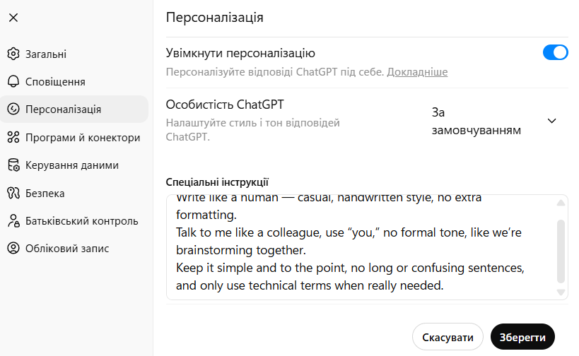
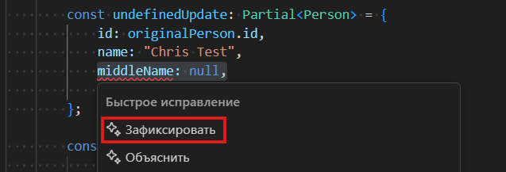
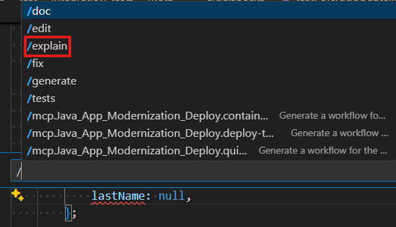
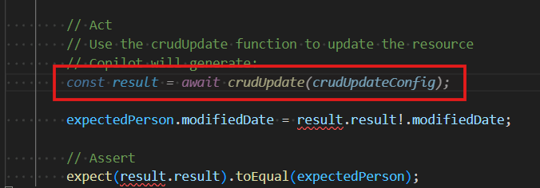

[⬅️ **full-development-flow**](../full-development-flow/full-development-flow.md) • [**content**](../README.md) • [**project-setup** ➡️](../project-setup/project-setup.md)

---

# AI Usage Guide for Developers

### Basics

AI is an assistant, not a replacement. It helps, but you make the decisions. Develop your skills, don't rely on it completely. Use AI for learning and improving productivity.

[ChatGPT](https://chatgpt.com/), [Gemini](https://gemini.google.com) — Routine tasks, documentation explanations, quick and free answers.

[Claude](https://claude.ai/), [Z.ai](https://chat.z.ai/), [DeepSeek](https://www.deepseek.com/) — Complex code, architectural decisions, analysis and explanation of complex logic, step-by-step analysis, mathematical problems.

> ⚠️ Always verify generated code and information in all cases!

Use personalization that allows AI to better understand your work style, technology stack, and code requirements.

Specify in settings:

-   Your technology stack (languages, frameworks)
-   Code style
-   Versions of technologies you use
-   Preferences (TypeScript instead of JavaScript, etc.)
-   Response format that's more convenient for you





Personalization example:

```
Write like a developer, not a marketer — clear, concise, and practical.
Use a friendly but technical tone, like you’re explaining something to another engineer during a code review.
Avoid fluff — keep it short, logical, and focused on real examples or solutions.
Use technical terms naturally, only when they help make things precise.
```

> 💡 Context Support
>
> -   Start new chats with task description and context
> -   Provide examples of existing code
> -   Specify project-specific requirements or constraints

> ⚠️ NEVER SHARE WITH AI:
>
> -   API keys, tokens, passwords
> -   Configuration files with secrets
> -   Private SSH keys

### AI in VS Code

#### I. [Kilo Code AI Agent extension for VS Code](https://marketplace.visualstudio.com/items?itemName=kilocode.Kilo-Code) - AI chat directly in VS Code

> ⚠️ Highly recommend checking out this additional guide: [**Codebase indexing in Kilo Code**](./codebase-indexing-in-kilocode/codebase-indexing-in-kilocode.md)


#### II. [VS Code Copilot Guide](https://code.visualstudio.com/docs/copilot/overview)

Installation:

1. [Install the "GitHub Copilot" extension from Marketplace](https://marketplace.visualstudio.com/items?itemName=GitHub.copilot)
2. Sign in to your GitHub account
3. Activate subscription (student and corporate versions available) or use the free version

#### Main Features

1. Code Autocompletion

    Copilot automatically suggests code while you type.

    **Hotkeys:**

    - `Tab` - accept suggestion
    - `Esc` - reject
    - `Alt + ]` - next suggestion
    - `Alt + [` - previous suggestion

2. Error Fixing

    **Copilot Chat for fixing:**

    1. Select code with error
    2. Press `Ctrl + .`
    3. Click "Fix"
    4. Copilot will suggest fixes

    

3. Code and Error Explanation

    **Explaining complex code:**

    1. Select code
    2. Press `Ctrl + I` and type `/explain`

    

4. Copilot Chat

    **Opening:**

    - `Ctrl + Shift + I` - open Chat panel
    - `Ctrl + I` - Inline Chat (in editor)

    **Useful commands:**

    - `/explain` - explain selected code
    - `/fix` - fix problem
    - `/tests` - generate tests
    - `/doc` - add documentation

5. Code Generation from Comments

    Write comments in Ukrainian or English, move to a new line and Copilot will suggest code:

    

    Press TAB to accept it

---

[⬅️ **full-development-flow**](../full-development-flow/full-development-flow.md) • [**content**](../README.md) • [**project-setup** ➡️](../project-setup/project-setup.md)
