[⬅️ **env**](../ai.md) • [**content**](../../README.md)

---

# Codebase Indexing in Kilo Code

This tutorial explains how the Codebase Indexing feature works in Kilo Code and how to set it up step by step. With indexing enabled, Kilo Code can "understand" your project: finding the right files, functions, and code snippets not just by keywords, but by meaning.

---

## What is Codebase Indexing?

**Codebase Indexing** is a process where Kilo Code analyzes your project and creates a "map" of it.

After indexing, you can ask questions like:

-   "Where is the user authentication logic implemented?"
-   "Show me the code that connects to the database."

Kilo Code will find the relevant places in your code even without exact file or function names.

---

## How Indexing Works

### 1. Embeddings

Each code snippet is converted into a vector representation (embedding) using an AI model.

This allows the system to understand the meaning of code, not just the text.

### 2. Storage

Vectors are stored in **Qdrant** — a fast and simple vector database.

### 3. Search Activation

After indexing, you can use the **Codebase Search** tool in Kilo Code for semantic search across your project.

---

## Activating Indexing in Kilo Code

1. Open Kilo Code
2. Find the database icon below the chat window

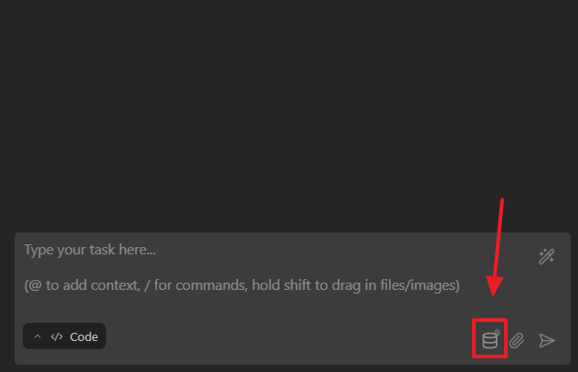

3. Click on it — the **Code Index Setup** window will appear
4. Enable the indexing feature

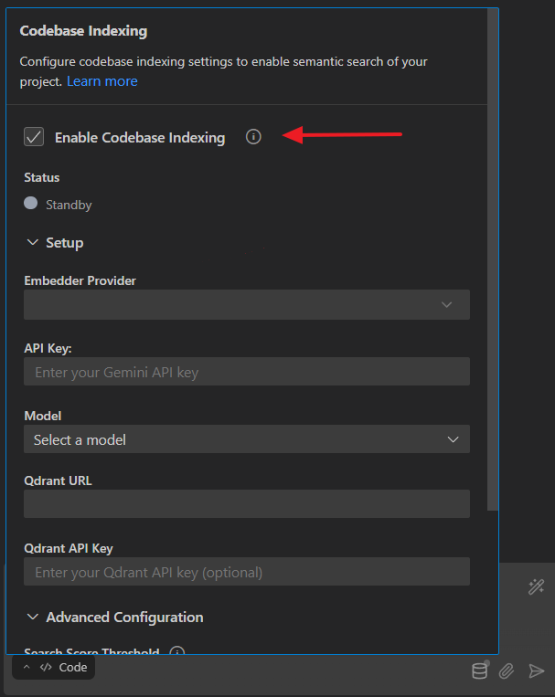

---

## Configuring Models and Database

### Step 1. Choose an Embedding Model

You can select different models:

-   **OpenAI, Gemini, Mistral, ...**
-   or use your local models: **Ollama, LM Studio**

#### Option: **Gemini**

1. Get a Gemini API key - https://aistudio.google.com/api-keys

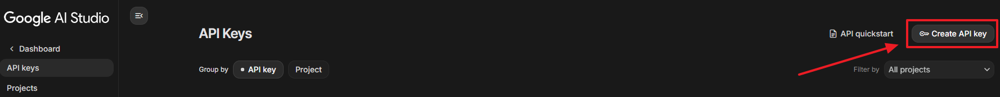

2. Paste the key into Kilo Code and select the **gemini-embedding-001** model

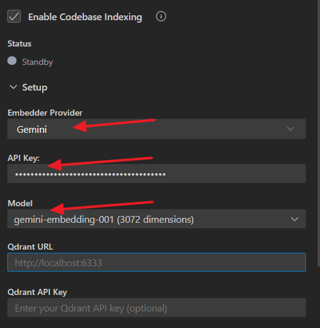

### Step 2. Set Up Qdrant Database

You can use:

-   Qdrant Cloud (recommended — simple and free up to 1 GB)
-   Qdrant locally via Docker

#### Option **Qdrant Cloud**:

1. Register at - https://qdrant.tech
2. Create a new cluster

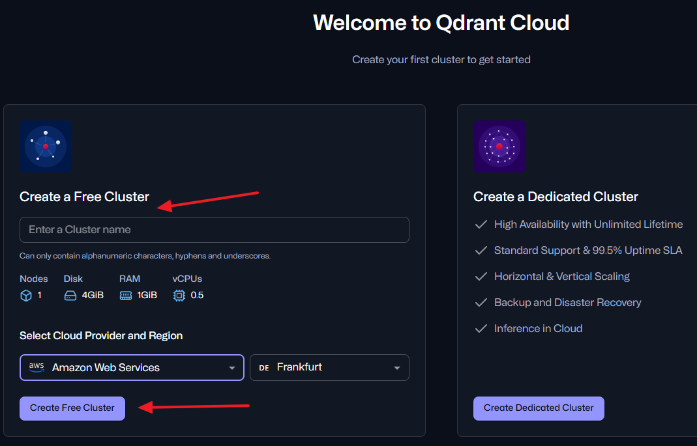

3. Choose a provider (Amazon or Google) and region
4. Copy the **API key** and **endpoint URL** and paste them into the Kilo Code settings

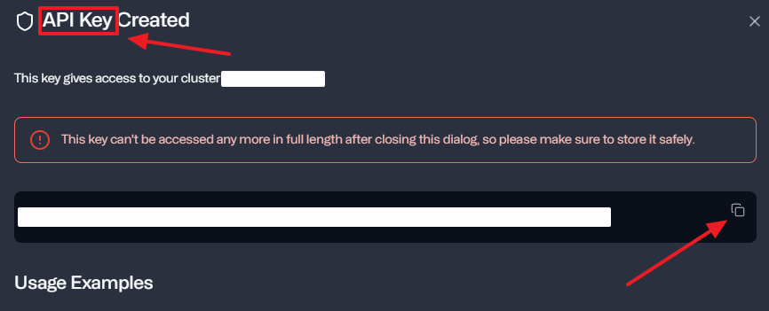
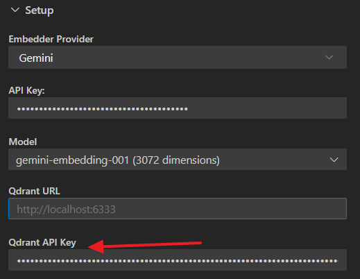
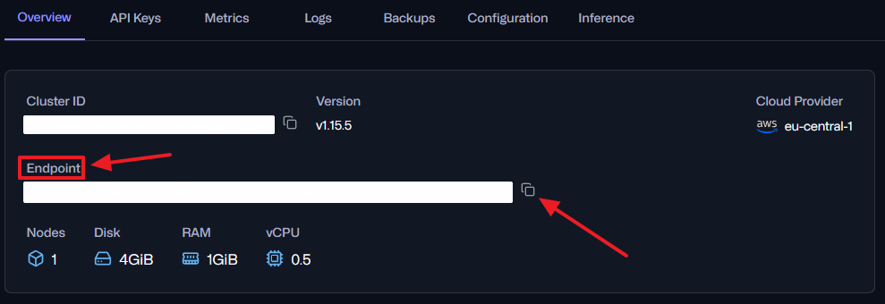
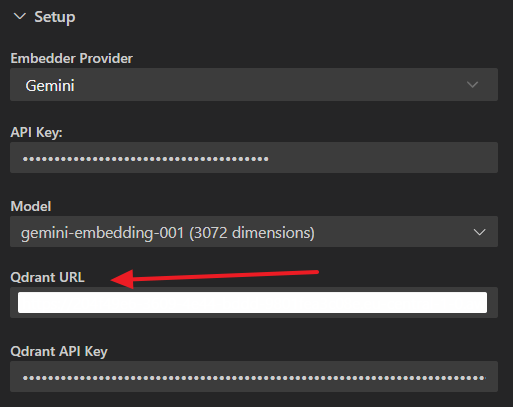

---

## Running Indexing

1. Save the settings

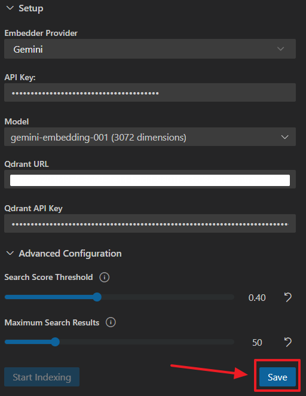

2. Click the **Start Indexing** button

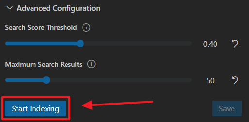

3. Wait for Kilo Code to complete the process (this may take some time, depending on the embedding model)

### Troubleshooting

If the process appears to be stuck (for example, at 240 blocks), the free embedding model may need more time due to rate limits.

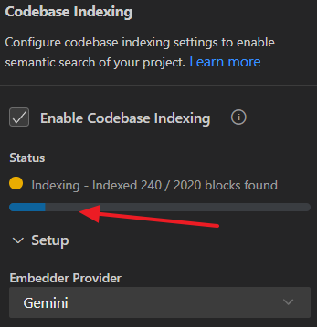

Either wait for it to complete, or try switching to a different embedding model and restart indexing.

---

## Testing and Verification

1. In Kilo Code, switch to **Ask** mode
2. Try a query:

```
show me how to run tests for custom eslint rules in this project
```

Kilo Code will perform a semantic search through Qdrant and display relevant code snippets.

---

## Summary

The **Codebase Indexing** feature in Kilo Code allows you to:

-   Create intelligent code search
-   Connect different embedding models
-   Use cloud-based or local vector databases
-   Significantly speed up project analysis

For more detailed information, refer to the corresponding section of the official **Kilo Code documentation** - https://kilocode.ai/docs/features/codebase-indexing

---

[⬅️ **env**](../ai.md) • [**content**](../../README.md)
