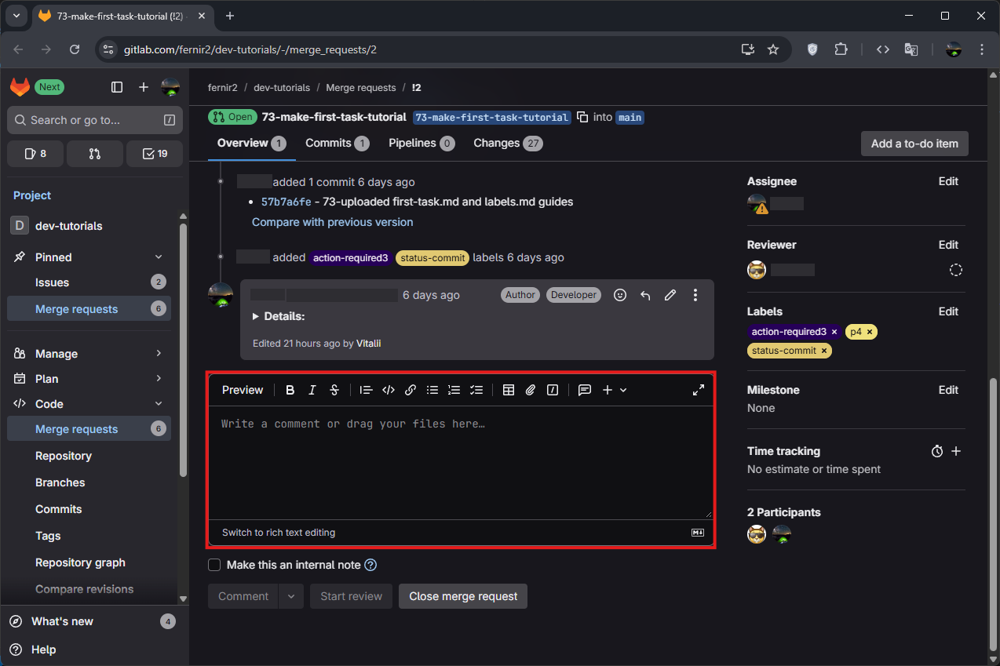
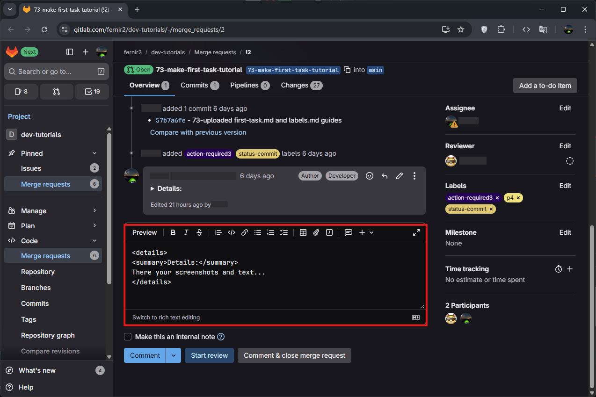
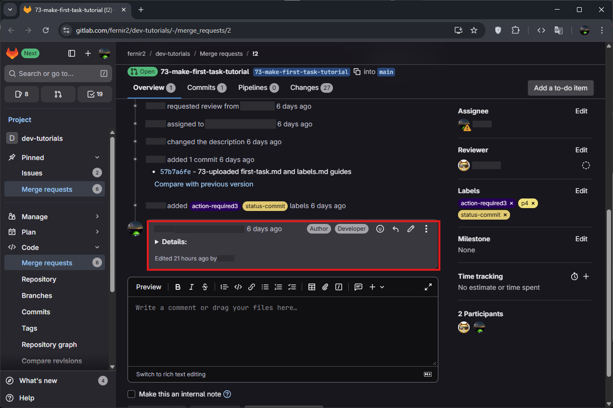
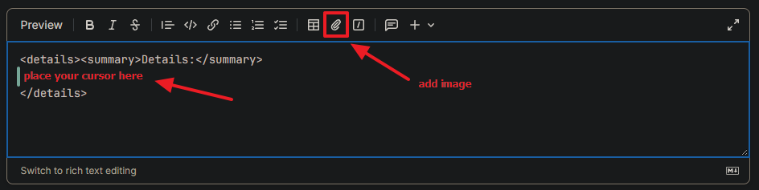
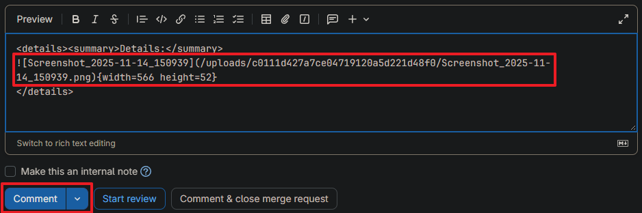
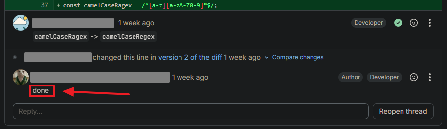

[⬅️ **labels**](../labels/labels.md) • [**content**](../README.md) • [**feedback** ➡️](../feedback/feedback.md)

---

# Comments

This short article discusses how to make your own comments on GitLab.

You can left your comments only when it necessary to describe what you do or you need to proof that something works fine after your changes.

You can left comments **only** on merge requests!

To make comment go to your merge request then scroll down and you will see textarea form:



You must write large comments at `<details>` block with summary!

**Why use details tags?**  
The `<details>` block keeps comments collapsed by default, making the merge request page cleaner and easier to navigate. Reviewers can expand only the comments they want to read. For example:

```
your short one-line responses
<details>
<summary>Details:</summary>
screenshots, logs, large code examples...
</details>
```



Result on GitLub:



Or you can add a screenshot in the same way:



> You can also just press **Ctrl+V** (**Cmd+V** on Mac) — this will paste a screenshot from your clipboard.



Always reply to each reviewer’s comment, even briefly, to confirm that you have addressed it.  
You can write short responses like “Fixed”, “Done”, or “Updated” to show that you reviewed and resolved the issue. For example:



---

[⬅️ **labels**](../labels/labels.md) • [**content**](../README.md) • [**feedback** ➡️](../feedback/feedback.md)
