[⬅️ **project-setup**](../project-setup/project-setup.md) • [**content**](../README.md)

---

> ⚠️ **Please note that this section requires access to the _monorepo_ repository.**

# Setting Up Environment Variables

### How to work with env?

What exactly is env? Env it's file which is used in projects to store configuration settings, environment variables, and sensitive information securely.

We use an env files in monorepo. To create your own working env file, follow these steps:

1. Open monorepo project in your IDE.
2. Create a .env file in the root of the project like this:
   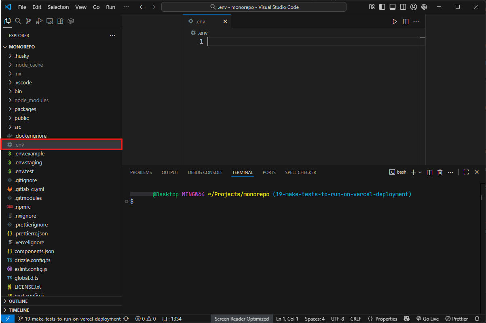
3. Open env.example, copy all of its contents, and paste them into the newly created .env file. This can be done using the key combinations Ctrl + A, Ctrl + C.
4. Paste the copied contents of env.example into the .env file you created and save it with Ctrl + S:
   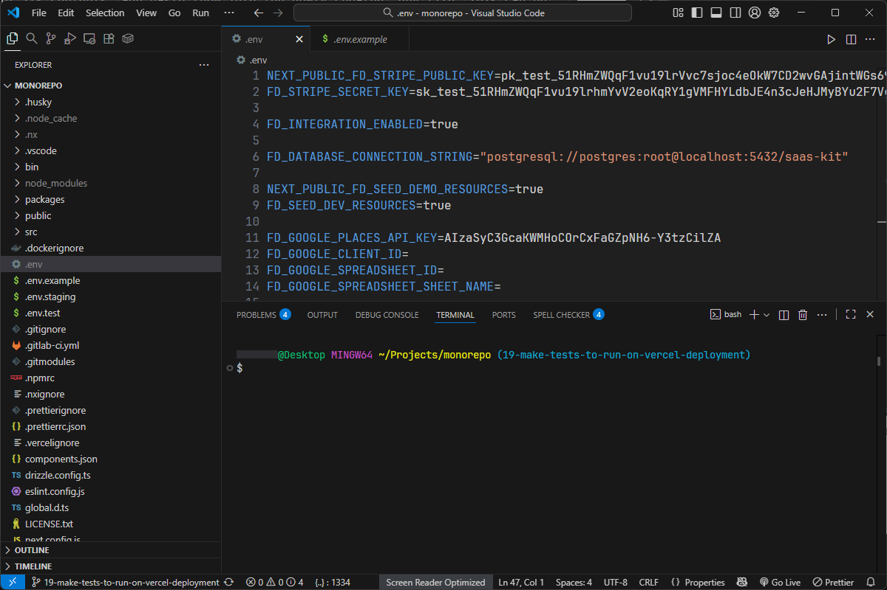

Our project uses one more env file that you need to create. Open the packages/test folder. Inside this folder, create a .env file as shown here:

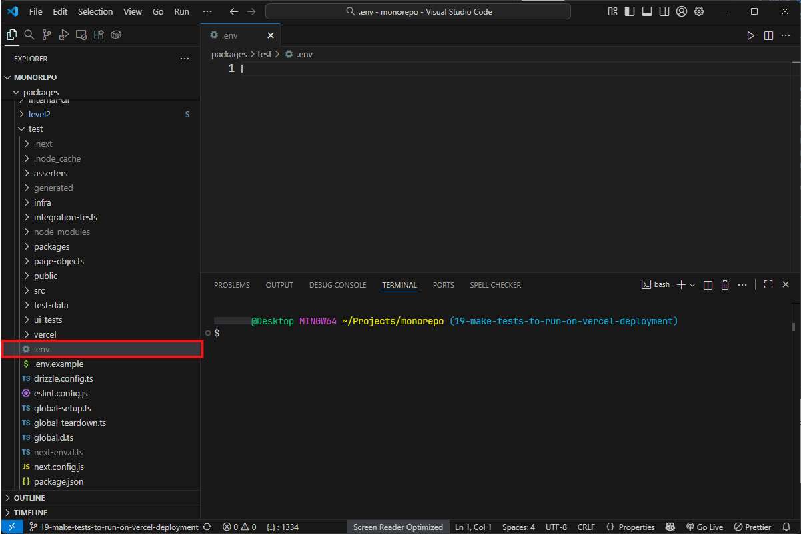

Now you need to do the same thing we did the first time. Open env.example located in packages/test folder, copy its contents, paste them into our new .env file and save it like this:

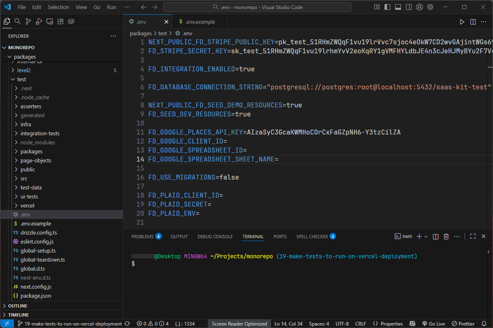

### PostgreSQL

You need to install the PostgreSQL database that our project works with and modify the .env file. Let's start by setting up the database.

You can install it from the official website:

-   [windows](https://sbp.enterprisedb.com/getfile.jsp?fileid=1259779)
-   [linux](https://www.postgresql.org/download/)
-   [Mac OS](https://sbp.enterprisedb.com/getfile.jsp?fileid=1259776)

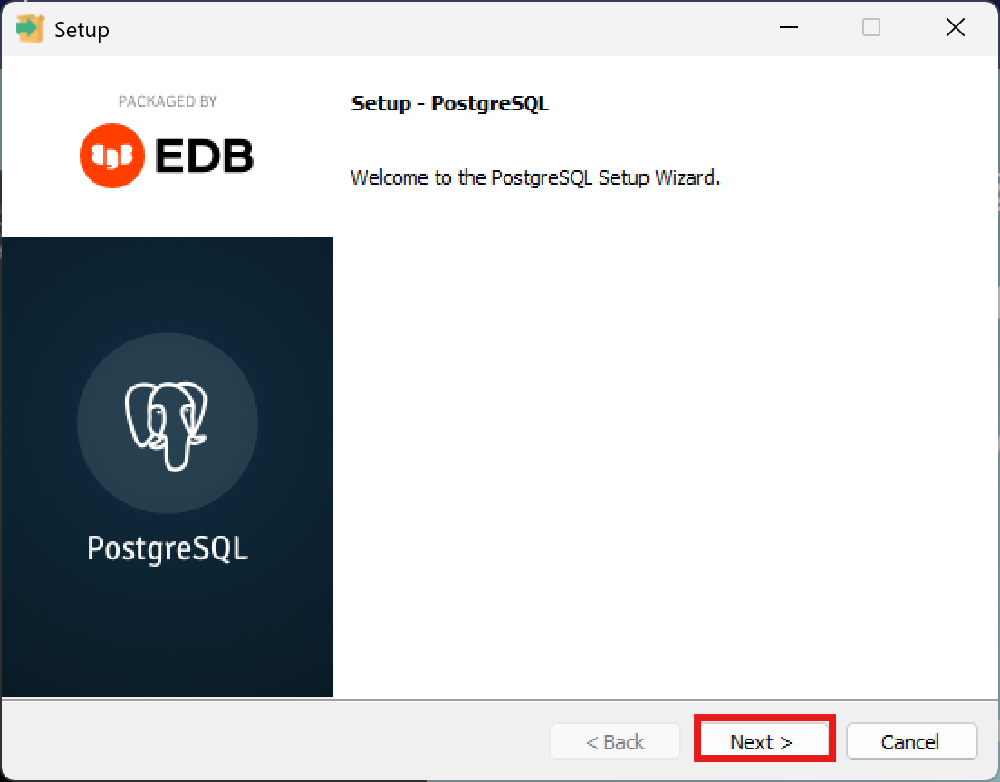

Click on the Next button.

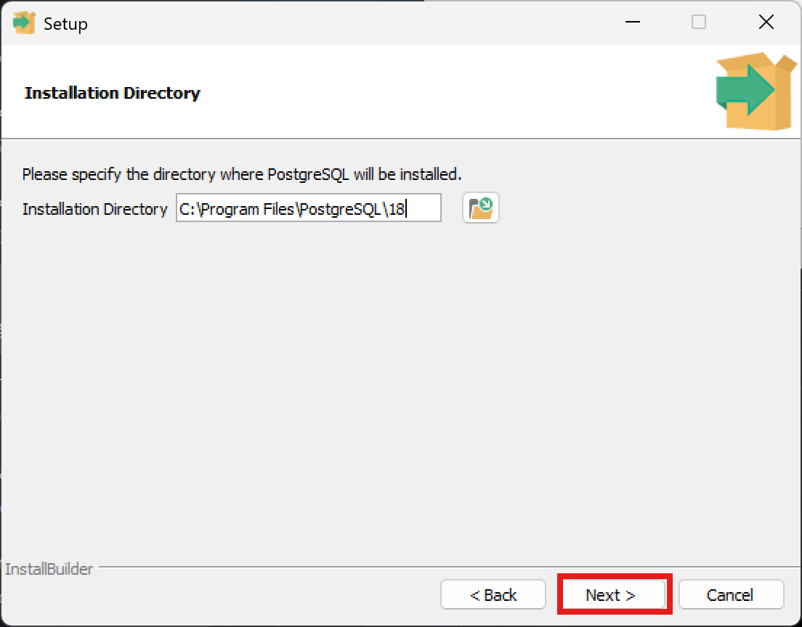

Click on the Next button.

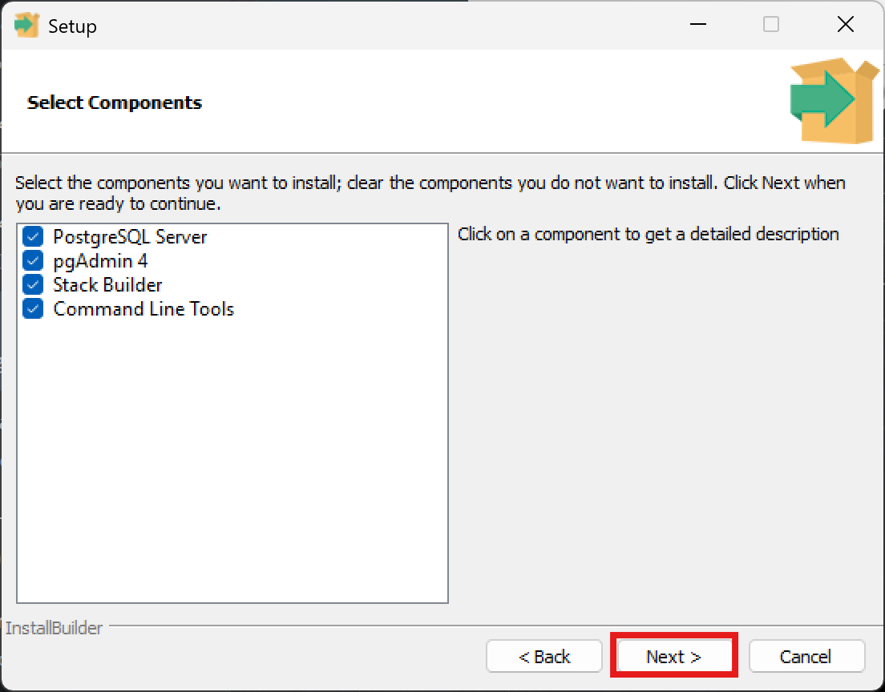

Check all the boxes and click the Next button.

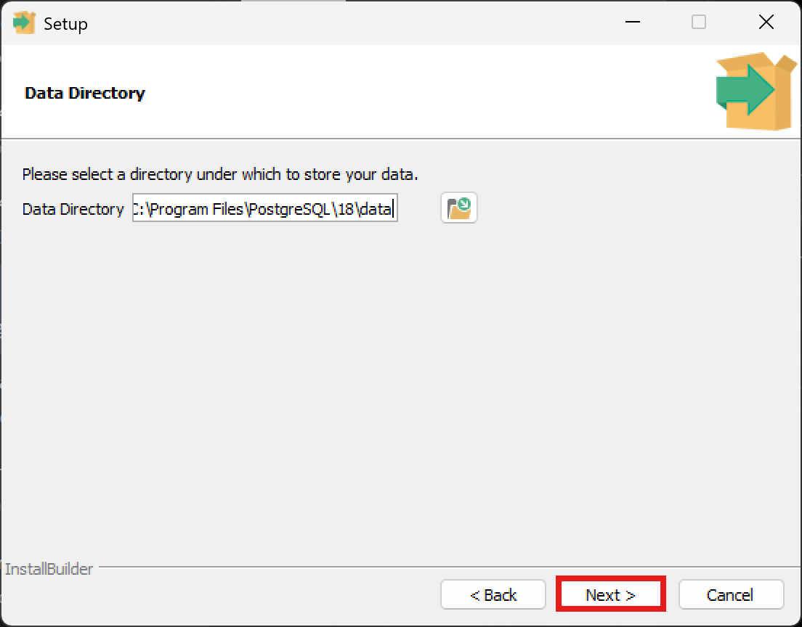

Click on the Next button.

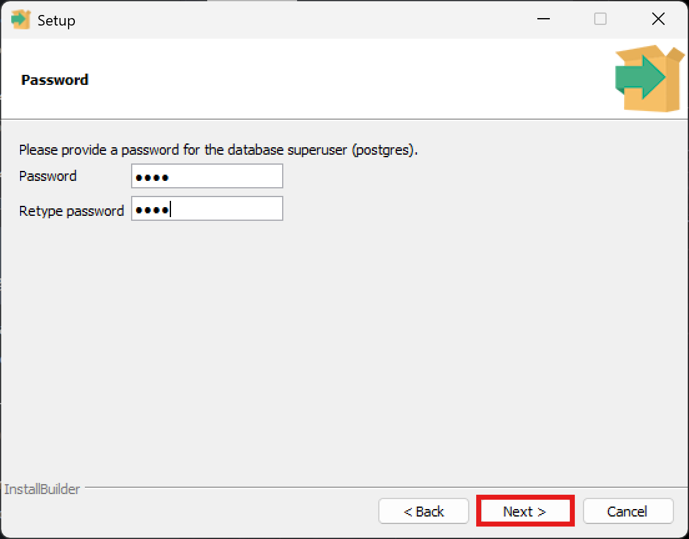

Enter "root" password (without quotes), then click the Next button.

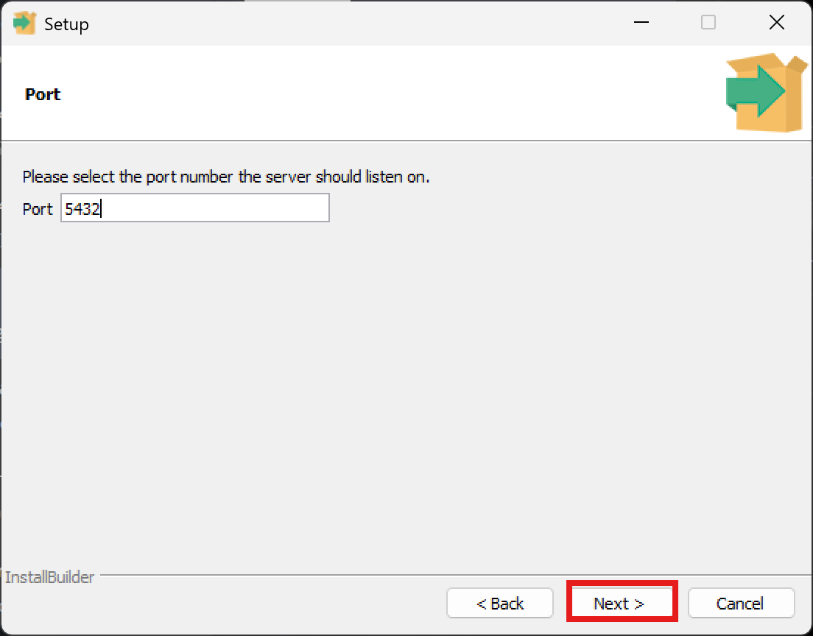

Click on the Next button.

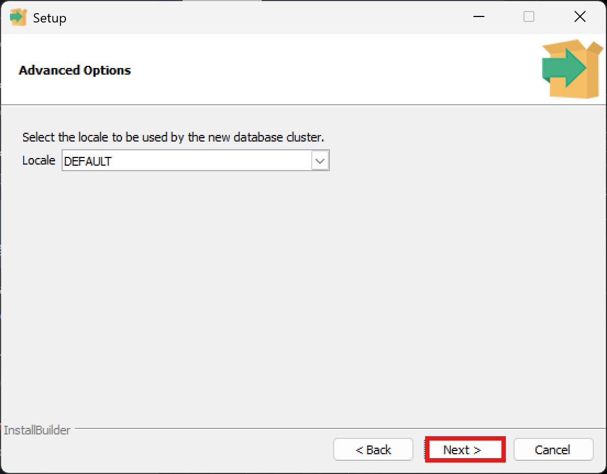

Select your locale and click the next button.

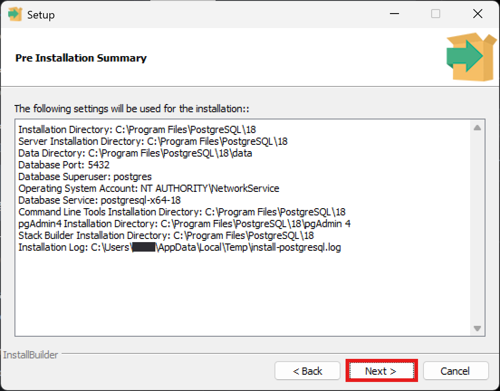

Click on the Next button.

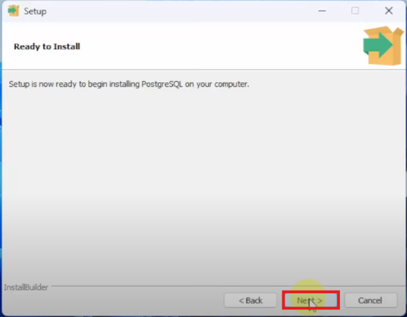

Click on the Next button.

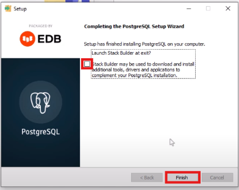

Uncheck the box and click the Finish button.

We have now configured your .env files and downloaded postgreSQL!

---

[⬅️ **project-setup**](../project-setup/project-setup.md) • [**content**](../README.md)
