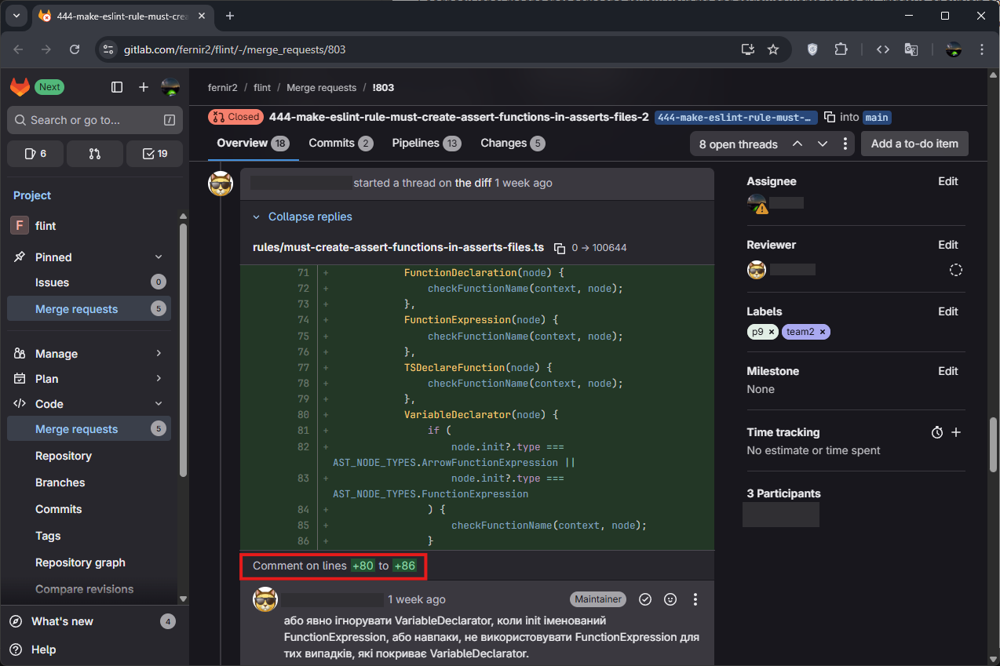
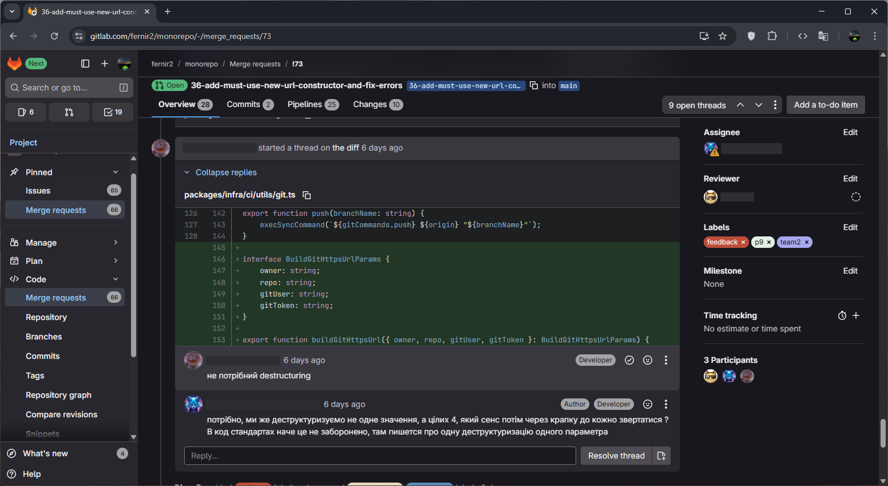

[⬅️ **comment**](../comment/comments.md) • [**content**](../README.md) • [**git-conflict-resolution** ➡️](../git/git.md)

---

# Feedback

The feedback process is a core part of code review. When you receive feedback, it means a reviewer has suggestions for improving your code. This guide explains how to handle feedback effectively.

### Understanding Feedback

Feedback label means that someone review your mr and reviewer wants you to fix, improve or explain something.
Mostly reviewers mark the line or part of the code that needs to be corrected or explained and reviewer leave a short comment about what needs to be corrected. For example, here:



I highlighted in red the message that says which lines this comment refers to. But mostly you won't get this message, in this cases comment refers to last line of marked part of the code like here:



If you think the comment is incorrect, you can give a brief constructive response. Then remove `feedback` label and set `action-required3`, `code-review` labels.

But if comment have sense you need to remove feedback label from your mr. Then remove `review` label from your task/issue and set `in-progress` label if you would fix it right now, if later - `pause`.

### Fixing Your Task

If you need to fix your task - copy branch name, open your IDE. Go to your branch, your already should to know this command:

```
git checkout branch-name
```

Make changes according to the comments you have received. Then commit your changes, push them:

```
git add .
git commit -m "Commit message"
git push origin
```

Now open your mr on GitLab, set `action-required3` and `code-review` labels. Open task/issue and remove `in-progress` label and set `review` label. Then wait new `feedback` or `approve` label.

---

[⬅️ **comment**](../comment/comments.md) • [**content**](../README.md) • [**git-conflict-resolution** ➡️](../git/git.md)
