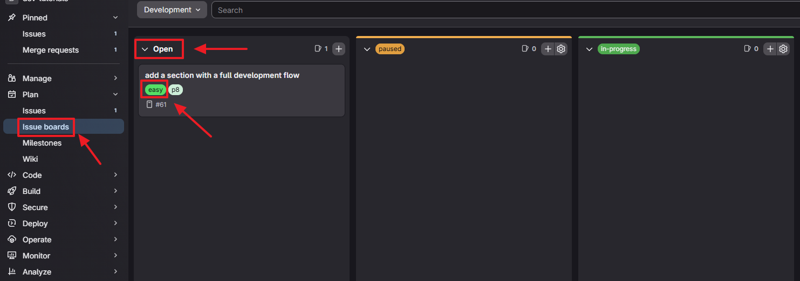
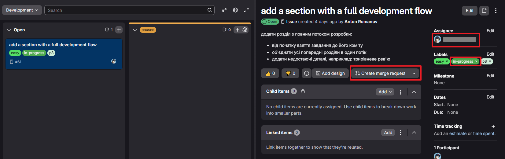
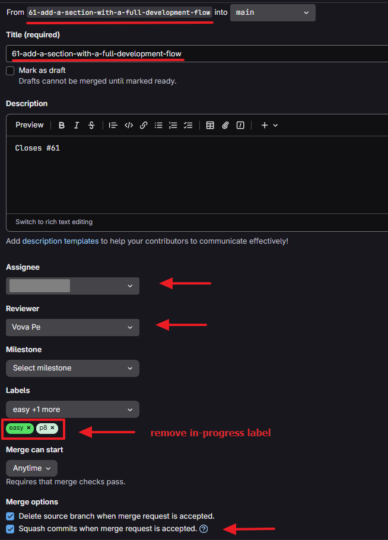
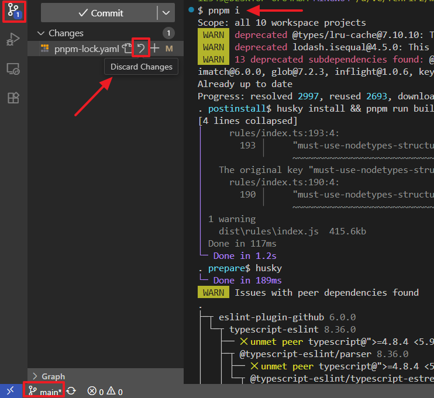
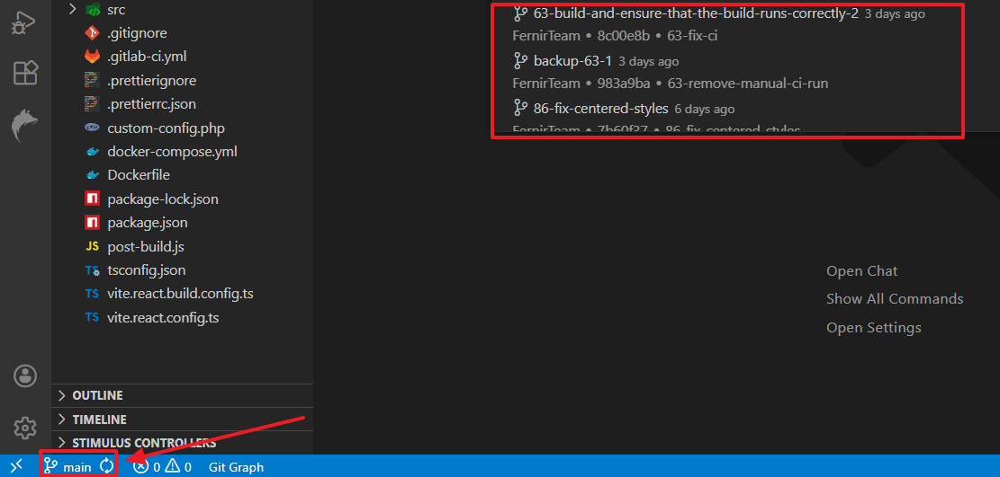
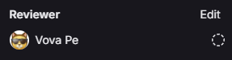
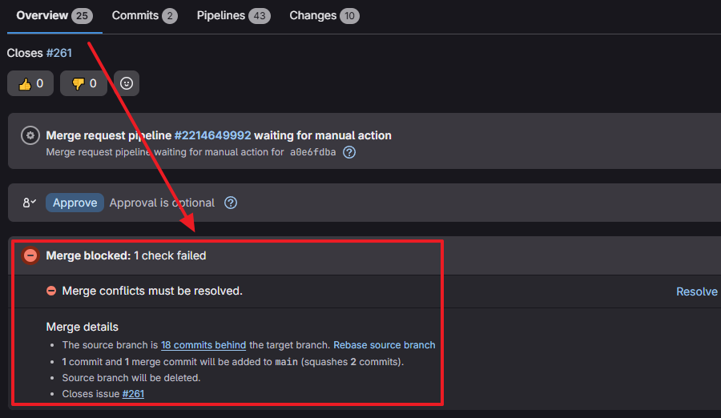
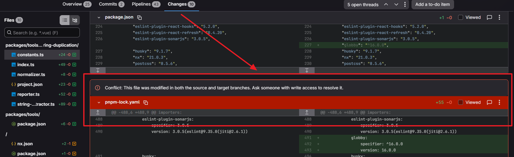

[⬅️ **running-and-testing-eslint-rules**](../running-testing-eslint-rules/running-testing-eslint-rules.md) • [**content**](../README.md) • [**ai** ➡️](../ai/ai.md)

---

# Full Development Flow

This guide serves as a summary of the entire development process, from taking a task to merging it. It connects the practical skills covered in other tutorials into a single workflow.

## Take a task

🔗 [First Task: Workflow](../first-task/first-task.md)

1.  Go to the **Issue Board** and pick a task with label `easy`:

    -   if you have just joined the monorepo, you are only allowed to take tasks labeled `easy`
    -   if you don’t see any easy tasks, contact one of the `helpers`
    -   if you’re not sure who the helpers are, ask the `onboarding coordinator` or `vova.pe`

    

2.  **Assign** the task to yourself and add the **`in-progress`** label:  
    
3.  Create a **Merge Request**:  
    

## Development

1.  In your editor, while on the `main` branch, run the following commands to ensure your local repository is up to date:

    ```bash
    git pull
    pnpm install
    ```

2.  If you see changes in files like `pnpm-lock.yaml` after running `pnpm install`, please discard them via your editor's source control interface:  
    

3.  Switch to the branch created for your Merge Request. You can do this using the command `git checkout <branch-name>` or via your editor's interface:  
    

4.  Perform the task (**write your code**)

5.  If the task requires it, run **tests and linter** (for example, if you’re implementing a custom ESLint rule: 🔗 [Running and Testing ESLint Rules](../running-testing-eslint-rules/running-testing-eslint-rules.md#testing-custom-rules))

## Review cycle and how commits are counted

> ⚠️ **Please read this section carefully!**

For all main technical questions, contact a `helpers` only.  
When assigning a `reviewer`, select the `vova.pe`, for example:  


The project uses **three-level review** process.  
This uses a specific set of labels:

-   `action-required3`
-   `action-required2`
-   `action-required`

> Note that you may only use the `action-required3` label.

For example, the development process may look like this:

-   You start working on a task:
-   You create **one commit** and set the label `action-required3`.
-   One of the `helpers` checks the task and leaves `feedback`.
-   You apply the fixes, set `action-required3` again - and you still have only **one commit** in total.
-   The `helper` rechecks the task and sets `action-required2`.
-   Then a `reviewer` reviews the task and leaves `feedback`.
-   You fix the issues again, set `action-required3` - and the task still contains only **one commit**.
-   The task passes the review stages again (`action-required3` + `action-required2`) and reaches `action-required`.
-   At this stage, the task is reviewed by a `tech advisor`, who either:
    -   accepts the task and set the label `approved` (the task is completed), or
    -   leaves `feedback`.
-   If `feedback` is provided at this final stage, you fix the issues and set `action-required3` again — but now your task contains **two commits** in total.

> Don't forget that, in addition to these labels, you must also use `code-review` or `status-commit`: 🔗 [Labels](../labels/labels.md)

## Submission

1.  **Commit your changes**:
    -   following the process: 🔗 [First Task: Workflow](../first-task/first-task.md)
    -   and following commit rules: 🔗 [Review cycle and how commits are counted](../full-development-flow/full-development-flow.md#review-cycle-and-how-commits-are-counted)
2.  **Verify author info**:
    -   ensure your commit has the correct author name and email: 🔗 [configuring Git identity](../project-setup/project-setup.md#3-set-your-name-in-git)
3.  **Push your changes and set the correct labels** 🔗 [Labels](../labels/labels.md):
    -   typically, you set `action-required3` and `code-review`.
    -   if the task is not yet complete use `action-required3` and `status-commit`
4.  **Add additional information in a comment on the MR if needed** 🔗 [Comments in Merge Requests](../comment/comments.md):
    -   add screenshots of test results (put them inside a `<details>` spoiler block)
    -   or add a detailed description of the implementation (large text should also go in a spoiler)
    -   or short sentence highlighting a specific feature of the implementation

## Feedback Loop

1.  **Approved**: if MR gets the `approved` label:
    -   you need to ensure there are no conflicts with the `main` branch before merging, here is how conflicts may appear in the GitLab interface:
        -   in section **Overview**
            
        -   or in section **Changes**
            
    -   use this section to resolve conflicts 🔗 [Git: conflict resolution](../git/git.md)
2.  **Feedback**: if MR gets the `feedback` label:
    -   follow the review cycle and commit counting rules 🔗 [Review cycle and how commits are counted](../full-development-flow/full-development-flow.md#review-cycle-and-how-commits-are-counted)
    -   make the necessary fixes
    -   add a short reply to the reviewer's comment 🔗 [Comments in Merge Requests](../comment/comments.md)
    -   push your changes again

---

[⬅️ **running-and-testing-eslint-rules**](../running-testing-eslint-rules/running-testing-eslint-rules.md) • [**content**](../README.md) • [**ai** ➡️](../ai/ai.md)
