[⬅️ **feedback**](../feedback/feedback.md) • [**content**](../README.md) • [**edit-commits** ➡️](../working-with-commits/working-with-commits.md)

---

### Before you start

To work on this task, you should have already completed:

-   [ide-setup](../ide-setup/ide-setup.md)
-   [first-task](../first-task/first-task.md)
-   [labels](../labels/labels.md)

### Updating to main and Resolving Conflicts

Clone the tutorial repository and navigate to it if you haven't done so already:

```bash
git clone https://gitlab.com/fernir2/dev-tutorials.git
```

> 💡 You can switch between projects using the `Ctrl+R` keyboard shortcut

Create a new task: `"git-tutorial-<your_name>"`.

> 💡 **\<your_name\>** — your name in latin letters; you can use the one from your Discord account: `name.surname` -> `name-surname`:

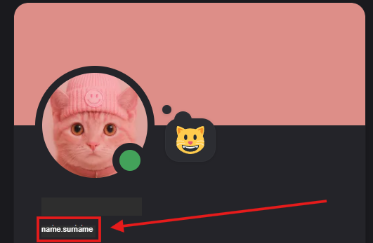

Set the required labels and assign yourself as the executor.

Move the task to the `in-progress` list.

Next, create a new `branch` and a new `merge request`.

> ⚠️ When creating a branch, copy the suggested name and paste it into the merge request name. They should always be the same! Create all merge requests using the standard settings you learned in [first-task](../first-task/first-task.md).

Set the default settings.

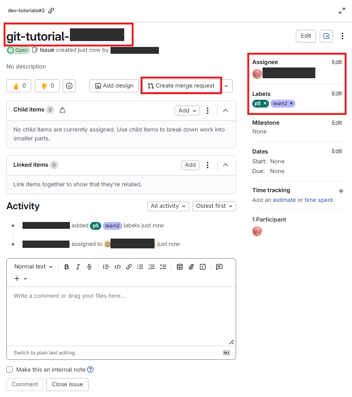

Switch to the created branch in VS Code.

Create a `git-practice` folder and an `index.ts` file, paste the following code into the file:

```ts
export const rule1 = "rule-1";
export const rule2 = "rule-2";
export const rule3 = "rule-3";
```

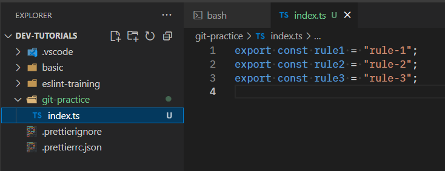

Make a commit and push the changes to the repository.

> ⚠️ **\<index\>** - When you create a task in GitLab, it automatically gets a unique number. Look at your task URL or title - the number at the beginning is your **index**. It helps keep branch names unique.

> 💡 In real projects, you normally work with the **main** branch as your base. However, we’ll create our own **practice main** branch that will act as main branch.
> 💡 The structure will look like this:

```
main (the actual main)
  └─ <index>-git-tutorial-<your_name> (your "practice main")
      ├─ feature-a (first feature)
      └─ feature-b (second feature)
```

> 💡 We’ll make it so that feature-a and feature-b modify the same part of the code. When you merge them one by one into your **practice main** a merge conflict will occur — and you’ll learn how to resolve it!

Create two new branches from your **practice main**:

1st branch

```bash
# Switch to your practice main branch
git checkout <index>-git-tutorial-<your_name>

# Create a new branch from your practice main
git checkout -b <index>-git-tutorial-<your_name>-feature-a
```

Add the new line of code shown in the screenshot

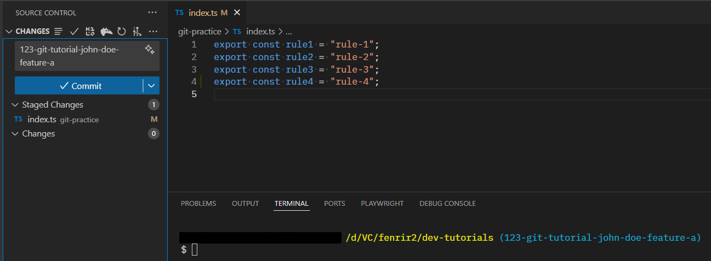

After making changes, you need to:

-   **Commit** - save changes locally
-   **Push** - send your commits to GitLab

You can push commit using the command:

```bash
git push -u origin <branch-name>
```

or

```bash
git push -u origin HEAD
```

> `-u` flag (or `--set-upstream`) - tells Git: "remember that this local branch connects to this remote branch". After this, you can simply use `git push` without extra parameters.  
> `HEAD` - is Git's way of saying "the branch I'm currently on". It's a shortcut so you don't have to type the full branch name.

> 💡 If you prefer using VS Code UI - click the **Publish Branch** button (as in screenshot above)

Repeat the same for the second branch:

2nd branch

```bash
# Switch to your practice main branch
git checkout <index>-git-tutorial-<your_name>

# Create a new branch from your practice main
git checkout -b <index>-git-tutorial-<your_name>-feature-b
```

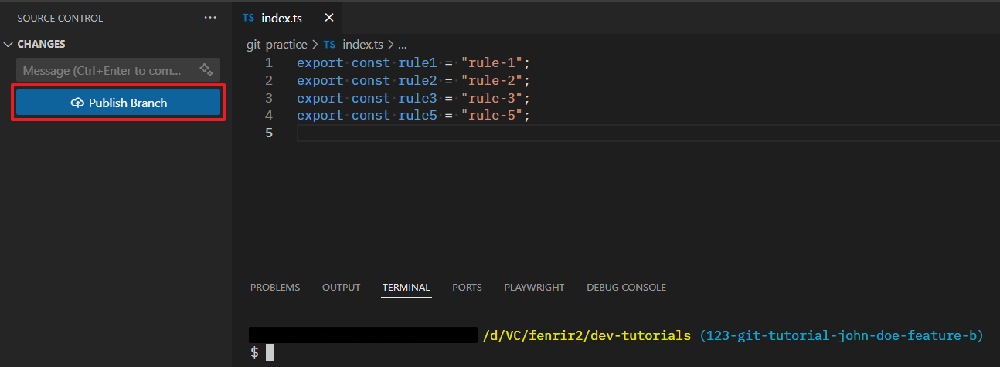

These two branches will modify the same file to trigger a conflict.

Go to GitLab as shown in the screenshot. Create a merge request for `<index>-git-tutorial-<your_name>-feature-a`.

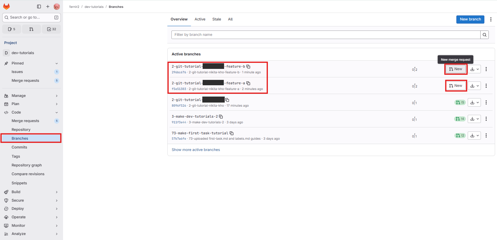

Set the default settings for the merge request, the result should look like this:

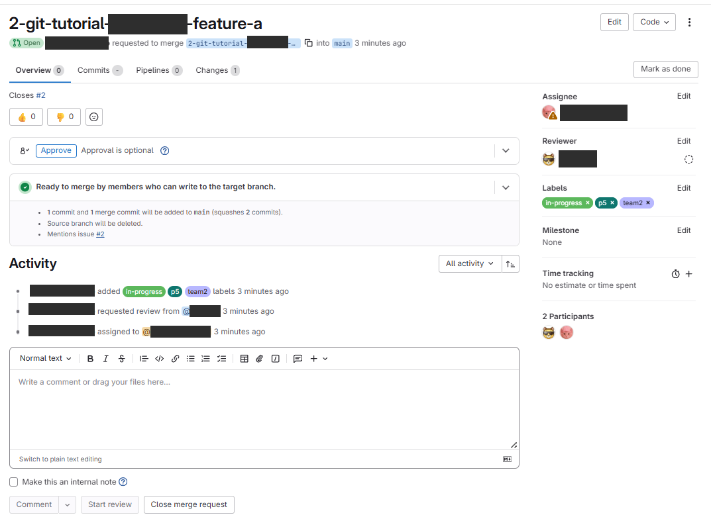

Edit the merge request by setting the target branch to the one you created at the beginning. Do the same for `<index>-git-tutorial-<your_name>-feature-b`. Don't forget to save the changes!

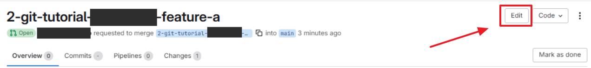

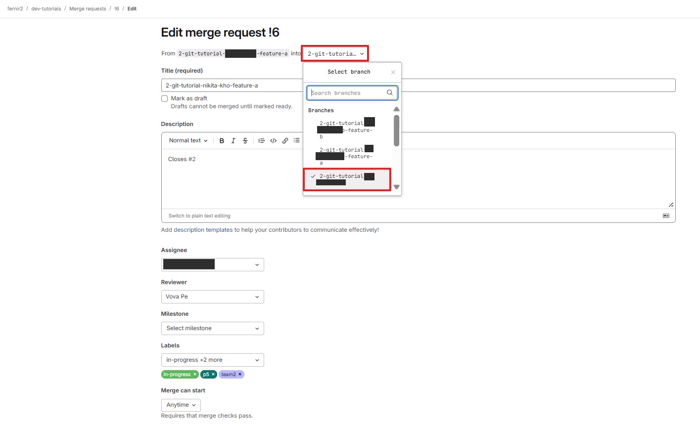

Merge branch A:

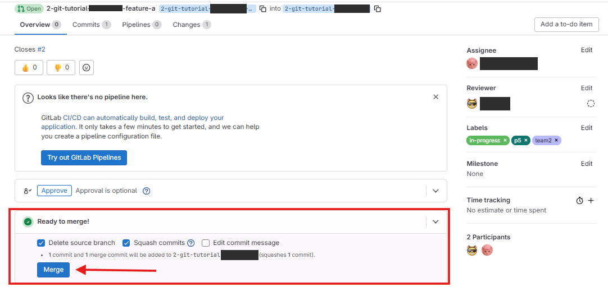

Close this window.

Go to the merge request for branch B and refresh the page. You will see a conflict message. Since you modified the same line, Git cannot automatically determine how to merge these changes, so you need to merge them manually. There are several ways to resolve conflicts:

1. Resolving in GitLab (**Recommended only for the most trivial conflicts!**)

    Click **Resolve conflicts**
    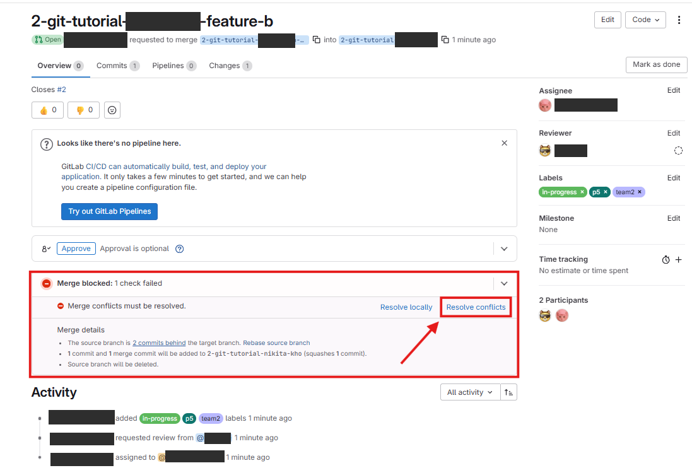

    After clicking, a list of conflicts will appear. You can choose one of the modes:

    - **Interactive** – choose which changes to keep.
    - **Inline** – edit each line manually.

    > ⚠️ Complex conflicts are better resolved locally in an editor to avoid errors.

    **We will consider another way to resolve conflicts**, so click the Cancel button!

    After resolving conflicts in this mode, click the **Commit** button to save changes. **But not in this example!**

    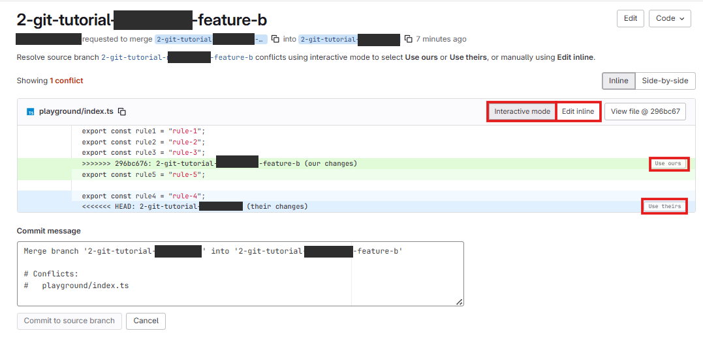

Switch to VS Code on our branch `<index>-git-tutorial-<your_name>-feature-b`

2. Resolving conflicts in VS Code.

    First, you need to update the branch to main. In normal work, you can use the commands:

    ```bash
    git fetch origin
    git merge origin/main
    ```

    - `git fetch origin` — downloads all the latest changes from the remote repository without modifying local branches.
    - `git merge origin/main` — merges the latest changes from `main` into your current branch.

    > ⚠️ Conflicts may occur during this process if the same part of a file was modified in both `main` and your branch.

    > ⚠️ `git merge origin/main` generates a commit message — you are not allowed to modify it. If you need to create the update commit manually, copy the generated message and use it in your command.

    In our case, use the update to our fake main (replace with your values):

    ```bash
    git merge origin/<index>-git-tutorial-<your_name>
    ```

    After executing the commands, your branch will be updated to the main branch and you will also be able to resolve all conflicts directly in the editor:

    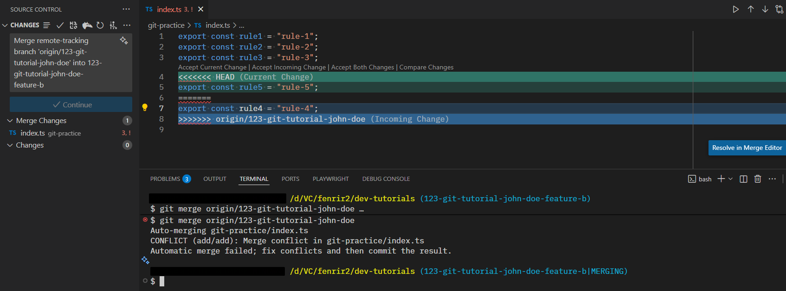

    You can resolve conflicts interactively (or edit the code), then add the file as resolved, and this will be the simplest and fastest option. Just create a new commit with the recommended name and push it:

    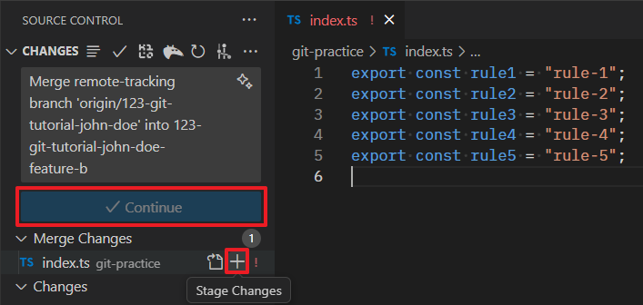

    But you can also use commands:

    1. Check the status:

    ```bash
    git status
    ```

    > Files with conflicts will be marked as `both modified`.

    2. Open each conflicted file and manually resolve the conflicts.

    Git marks conflicted sections like this:

    ```text
    <<<<<<< HEAD
    // Your changes
    =======
    // Changes from main
    >>>>>>> origin/main
    ```

    Keep the correct version and remove all markers `<<<<<<<`, `=======`, `>>>>>>>`.

    3. After resolving conflicts, add the files:

    ```bash
    git add <file1> <file2>
    ```

    or "." - all files

    ```bash
    git add .
    ```

    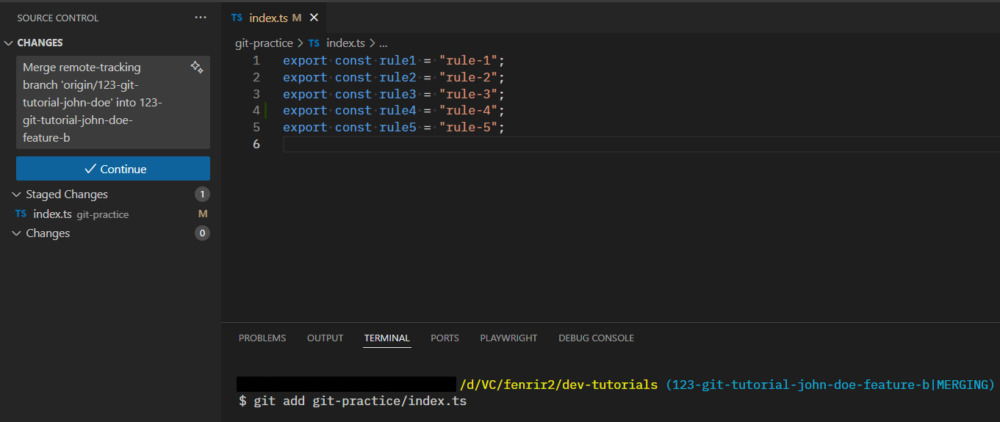

    4. Complete the merge:

    ```bash
    git commit
    ```

    5. After that, you can push the branch to GitLab:

    ```bash
    git push origin HEAD
    ```

All conflicts should have been resolved. Merge the branch and close the merge request.

Return to the main merge request. In the changes, you can see all the changes from all the branches you merged. Close this merge request!

Delete the task you created. Go to branches and delete the branch you created in this task.

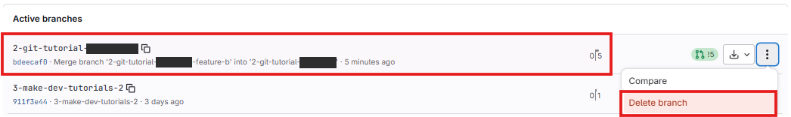

### Useful Commands

For a complete reference of Git commands, see [Git Commands](../git-commands/git-commands.md).

**Most frequently used in this workflow:**

-   `git status` - check current branch and changes
-   `git fetch origin` - download latest changes
-   `git merge origin/main` - merge main into your branch
-   `git add .` - stage all changes
-   `git commit -m "message"` - commit changes
-   `git push` - push to remote
-   `git push origin HEAD` - push the branch

More commands can be found [here](../git-commands/git-commands.md)

---

[⬅️ **feedback**](../feedback/feedback.md) • [**content**](../README.md) • [**edit-commits** ➡️](../working-with-commits/working-with-commits.md)
