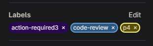

[⬅️ **first-task**](../first-task/first-task.md) • [**content**](../README.md) • [**comment** ➡️](../comment/comments.md)

---

### Labels

Now we recommend you to familiarize yourself with all the labels and their meanings.

These labels can only be on the tasks/issues and you can change them. **Don't set them on the [merge request!](../first-task/first-task.md#2-create-merge-request)**

-   `in-progress` - it means that task is already taken by someone and he work on it.
-   `review` - it means that task is waiting for review.
-   `paused` - it means that task is paused because people assigned to this task do another task or it's not his work time.
-   `blocked` - it means that you can’t finish the task right now for some reasons.

These labels can only be on the tasks/issues, merge requests and you mostly **can't** change them.

-   `p1`, `p2`, `p3`,`p4`,`p5`,`p6`,`p7`,`p8`,`p9` - this is a priority label, the lower number, the higher the priority of the task/issue.
-   `easy`- this label is used for simple tasks suitable for beginners. Such tasks usually don’t require deep knowledge of the project or complex technical solutions. **Experienced developers should not take tasks with this label**

These labels can only be on the merge requests and you can change them. **Don't set them on the [issue/task!](../first-task/first-task.md#1-create-and-take-the-task)**

-   `action-required3`- use this label to signal that you need the reviewer to take some action.
-   `code-review` - you set this label when you finished the task.  
    In most cases it looks like:  
    
-   `status-commit` - you need to make status commit if you haven’t committed anything for over 8 hours. More about it you can read [here](https://docs.google.com/document/d/1iG0VR5AFjNE7LFKdfEJm41AkUoHatgHa2NBIKXKIV9I/edit?tab=t.0#heading=h.vazy3g2uxrnx).
-   `feedback` - about this label we recommend you to read [this](../feedback/feedback.md).

These labels can only be on the merge requests and you **can't** change them. **Don't set them on the [issue/task!](../first-task/first-task.md#1-create-and-take-the-task)**

-   `action-require2`, `action-required` - this labels mean that your merge request is still under code review.
-   `approved` - it means your task was approved and waiting for merge.
-   `discuss` - you can read more about it [here](https://docs.google.com/document/d/1iG0VR5AFjNE7LFKdfEJm41AkUoHatgHa2NBIKXKIV9I/edit?tab=t.0#heading=h.p6zcgh16rvl2).

---

[⬅️ **first-task**](../first-task/first-task.md) • [**content**](../README.md) • [**comment** ➡️](../comment/comments.md)
