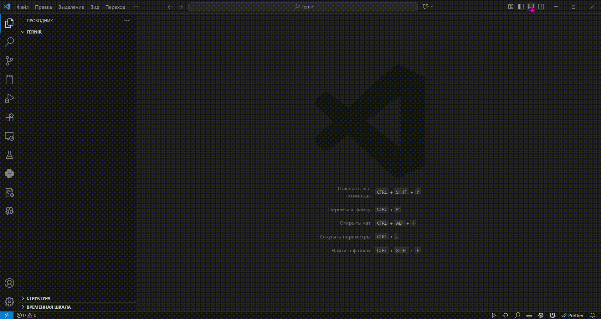
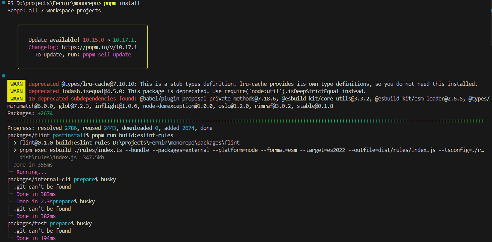
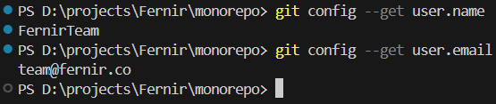

[⬅️ **ai**](../ai/ai.md) • [**content**](../README.md) • [**env** ➡️](../env/env.md)

---

> ⚠️ **Please note that this section requires access to the _monorepo_ repository. Contact your Onboarding Coordinator to inform that you have completed all previous sections and are ready to set up the _monorepo_ repository.**  
> ⚠️ **Complete this after the Onboarding Coordinator has directed you to the project.**

### 1. Clone [main repo(monorepo)](https://gitlab.com/fernir2/monorepo)

1. Create a folder in a convenient location.
2. Open it through VS Code.
3. Clone the repository as shown in the video. If VS Code prompts you to authenticate, authenticate through GitLab.

    ```bash
    git clone https://gitlab.com/fernir2/monorepo.git
    ```



### 2. Installing Dependencies

For further work, we need to update working dependencies.

1. Navigate to the project's root directory:

    ```bash
    cd monorepo
    ```

2. Run dependency installation:
    ```bash
    pnpm install
    ```

Our projects use pnpm, not npm.
From now on, all commands should be run through pnpm.



### 3. Set your name in git

For comfortable work with GitLab, you need to change your Git name and email to corporate ones. Specifically: name to FernirTeam, email - team@fernir.co

```bash
git config user.name "FernirTeam"
git config user.email "team@fernir.co"
```

After executing the commands, verify that the changes have been applied by entering the following commands. The result you should get is shown below.

```bash
git config --get user.name
git config --get user.email
```



---

[⬅️ **ai**](../ai/ai.md) • [**content**](../README.md) • [**env** ➡️](../env/env.md)
