[⬅️ **git-commands**](../git-commands/git-commands.md) • [**content**](../README.md) • [**full-development-flow** ➡️](../full-development-flow/full-development-flow.md)

---

# Running and Testing Custom ESLint Rules

ESLint is a static code analyzer for JavaScript/TypeScript that helps find and fix code issues. It checks code against defined rules and reports errors, potential bugs, and coding style violations.

## How ESLint Works

-   **Parsing**: ESLint transforms source code into an Abstract Syntax Tree (AST)
-   **Analysis**: Applies rules to AST nodes
-   **Reporting**: Reports found issues

ESLint runs as a separate Node.js process that:

-   Reads the configuration file
-   Loads rules
-   Checks project files
-   Outputs verification results

## Two Modes of ESLint Operation

### 1. Command Line Execution

In `package.json` files, you can find various commands that run the linter:

```json
{
    "scripts": {
        "lint": "...",
        "lint-sub": "...",
        "lint:src": "..."
    }
}
```

Or use direct execution:

```bash
pnpm eslint -c eslint.config.js
```

When running ESLint:

-   Searches for a configuration file (usually `eslint.config.js`)
-   Loads rules from the configuration
-   Checks specified files (by default, all files in the current directory)
-   Outputs results to the console

### 2. Editor Integration (Language Server)

ESLint also works in the background in your code editor (if the corresponding extension is installed):

-   Runs as a separate server process when the editor opens
-   Checks open files in real-time
-   Shows errors with red underlines directly in the code
-   Uses the nearest `eslint.config.js` configuration file relative to the file

## Working with Custom Rules

### Why Compilation Is Needed

Custom rules are typically written in TypeScript (`.ts`), but ESLint can only read JavaScript (`.js`) files. Therefore, rules must be compiled before use.

Often in `package.json` you can find similar build commands:

```json
{
    "scripts": {
        "build-eslint-rules": "..."
    }
}
```

### Custom Rule Development Workflow

#### Step 1: Making Changes

Edit the rule file in TypeScript (for example: `/rules/my-custom-rule.ts`)

#### Step 2: Compilation

```bash
pnpm build-eslint-rules
```

This command compiles TypeScript files to JavaScript.
Usually, this command is built into the next `lint` command so you don't have to run it separately.

#### Step 3: Testing in Command Line

```bash
pnpm lint
```

Now ESLint uses the updated version of the rule during verification.

#### Step 4: Updating in the Editor

**Problem**: After compilation, syntax highlighting in the editor may not update because the ESLint Language Server may cache loaded rules when the server starts.

**Solution**:

**Option A**: Restart ESLint Server (quick, but doesn't always work)

1. Press `Ctrl + Shift + P` (Windows/Linux) or `Cmd + Shift + P` (macOS)
2. Type: `ESLint: Restart ESLint Server`
3. Press Enter

**Option B**: Reload Editor Window (more reliable)

1. Press `Ctrl + Shift + P` (Windows/Linux) or `Cmd + Shift + P` (macOS)
2. Type: `Developer: Reload Window`
3. Press Enter

## Testing Custom Rules

### Where Tests Are Located

Tests for custom rules are usually located in the same module where the rules themselves are defined, in the `\tests` directory.
Commands for running tests can be found in `package.json` in the module with ESLint rules.

### Commands for Running Tests

```json
{
    "scripts": {
        "test": "...",
        "test:gen": "..."
    }
}
```

For example, running all tests:

```bash
pnpm test
```

Or running tests for a specific rule:

```bash
pnpm test my-custom-rule
```

## Complete Development Cycle

-   Make changes to the TypeScript rule file
-   Run tests: `pnpm test <rule-name>`
-   Check operation in CLI: `pnpm lint`
-   Reload editor window: `Ctrl + Shift + P` → `Developer: Reload Window`
-   Check error highlighting in the editor on any file that triggers this error

---

# Our special extension `Fernir Runner`

If you've mastered the mechanics of manually running commands, you can optionally use our special extension that automates some of these processes.

## Fernir Runner

Fernir Runner adds numerous conveniences for development and working with commands. Quick test execution, test case generation, project linting, creation and configuration of your own custom buttons.

To get started:

1. Go to Visual Studio Code, open the `Extensions` tab
2. Find [Fernir Runner](https://marketplace.visualstudio.com/items?itemName=Fernir.fernir-runner)
3. Download it and restart VS Code

After installation, you'll be able to see basic buttons on the bottom panel and a side menu for settings. Each command consists of 3 parts: name, description, and the project where it will be executed. When launching a command, it will automatically change the execution path to the required project. If a command applies to 2+ projects, you'll get a choice of where to execute this command.


If you don't need some buttons, open the extension's side menu, and in the `Visible Buttons` tab, hide the unnecessary commands.


You can also change the priority for buttons using the arrows nearby.

If other elements from other extensions are bothering you, right-click on the status bar, uncheck the extra elements you don't need.


To create your own custom commands, go to the commands tab and click `Add New Command`. Come up with a name and description for the command. Also enter your command in the appropriate field. You can use dynamic values in your command, there are currently 4 properties to choose from:

`{fileName}` - the name of the file you're in, without extension.

`{relativePath}` - relative path to the file.

`{fullPath}` - full path to the file.

`{fileNameFull}` - full file name including its extension.


Next, you can customize your button:
Choose an icon from the list, check whether you need to display the command name in the status bar, select a color for the icon and name. You can also choose 1 of 3 background options for the button: normal, red, and yellow. If you choose the last two, the icon and text color won't change.


If your command only applies to specific monorepo projects (or others), you can select the repository where this command will be executed. When launching the command, it will automatically navigate to the specified location. You can also select a command category for convenient display in the list of all commands. To select multiple categories or repositories, hold `Ctrl` and select the ones you need.

> You can create your own category or repository and its path in 2 separate tabs.


For some cases, it's sometimes useful to have parameters that can be quickly changed when launching a command. For this, you can create them in the Flags section. All selected flags are added to the end of the main command when launched.


Now when launching the command, you'll have this choice:


As a result, you'll get this output:


### Extension Development

**Installing dependencies**

```bash
pnpm install
```

**Development mode**

Press `F5`
Then choose `compile` or `watch`

**Production build**

```bash
pnpm run package
(skip): y
(skip): y
```

---

# Example of Using the `Fernir Runner` Extension

-   **After completing work on an ESLint rule and creating tests for it:**

    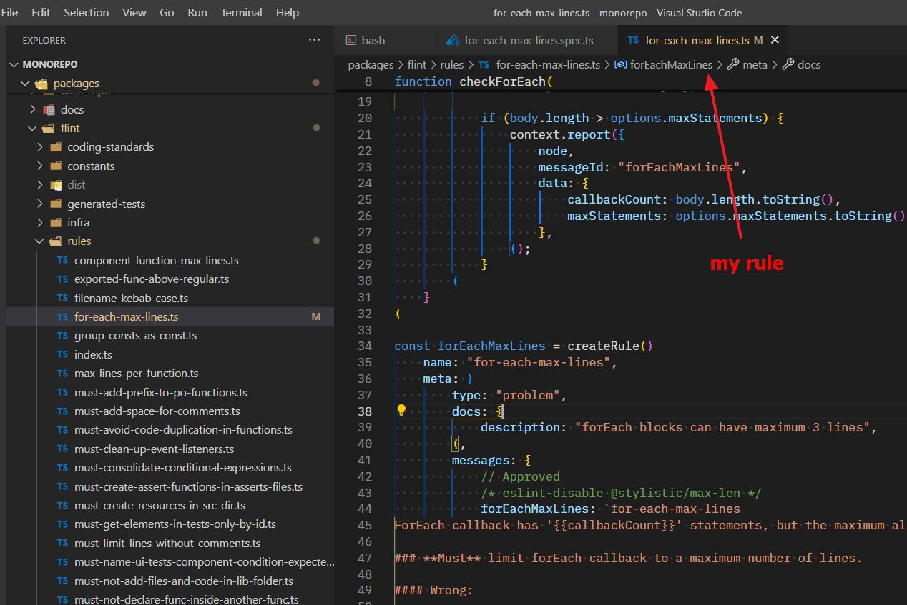

    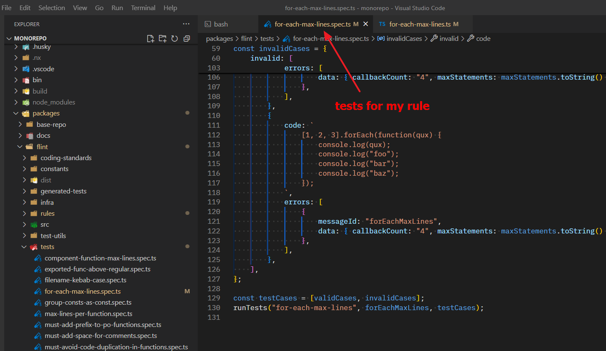

-   **Run these tests using the extension:**

    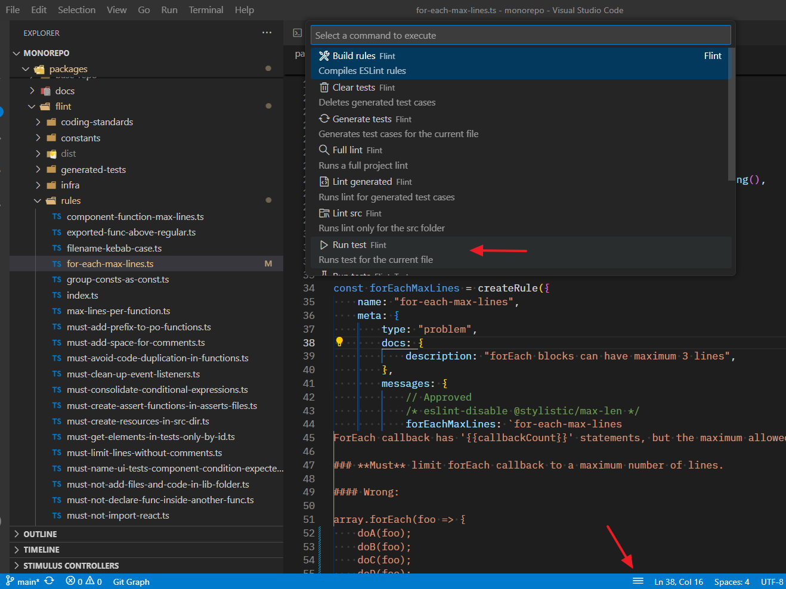

-   **Check the test results in the terminal:**

    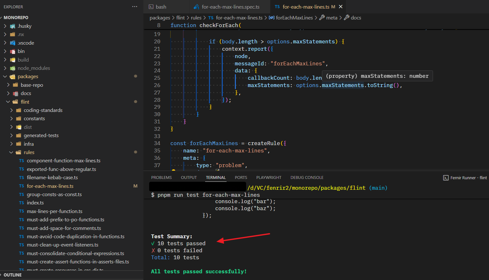

-   **After that, you can verify how the rule works by running the linter. To do this, you need to add the rule in the linter configuration, for example like this:**

    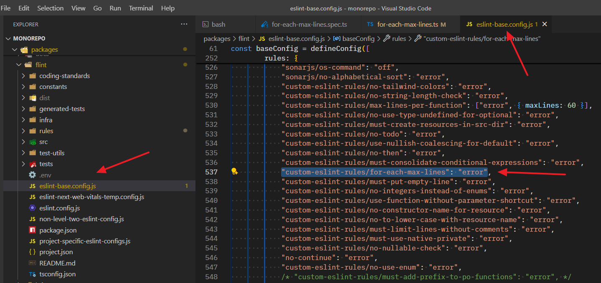

-   **If the tests are successful, temporarily generate validation examples from the tests:**

    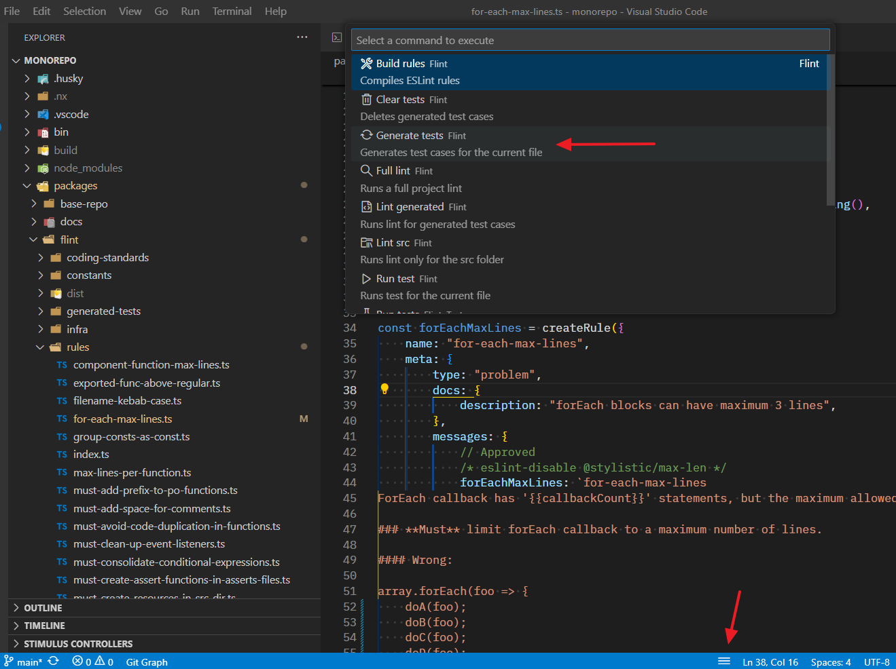

    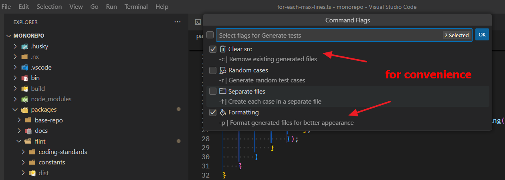

    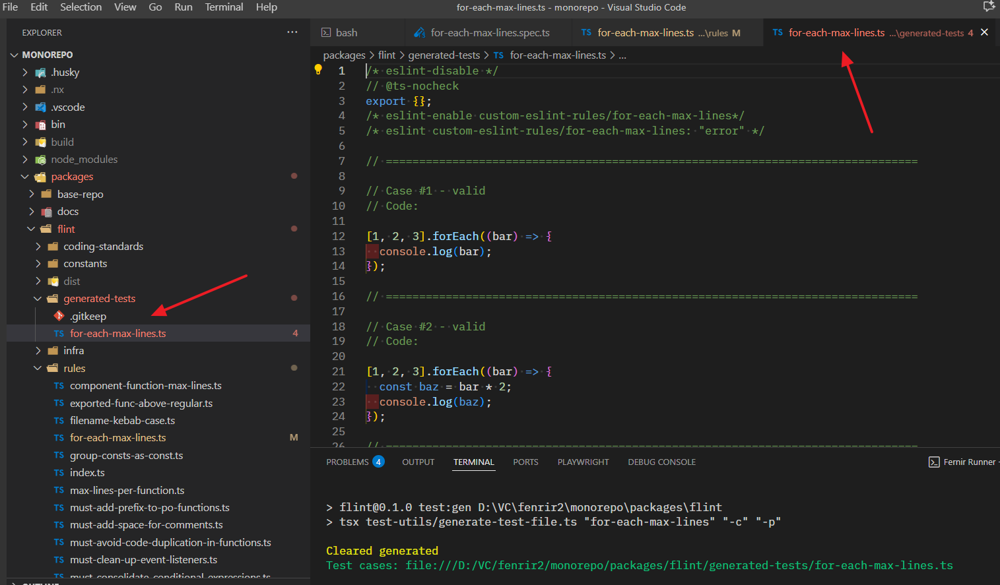

-   **Run the linter check on them:**

    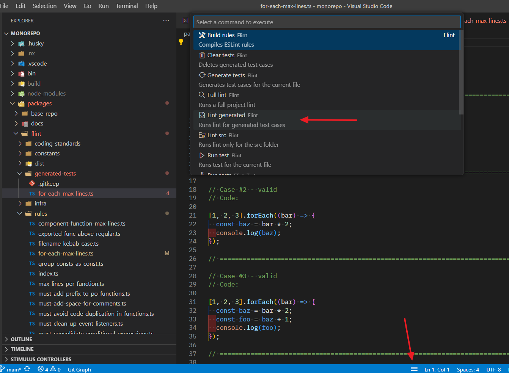

-   **Make sure that the rule doesn't trigger on all valid cases and does trigger on all invalid cases:**

    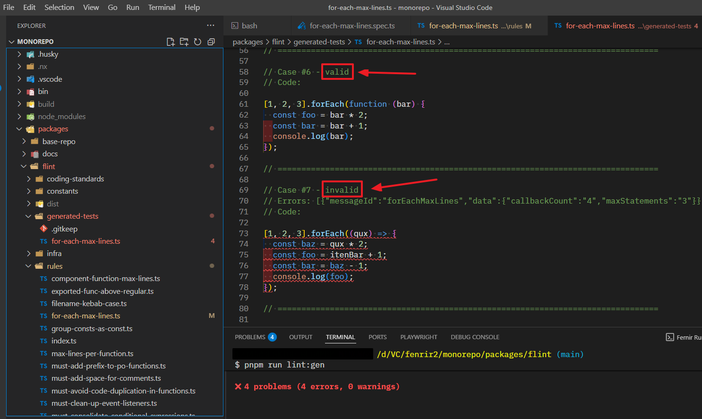

-   **Now you need to delete the temporarily generated examples:**

    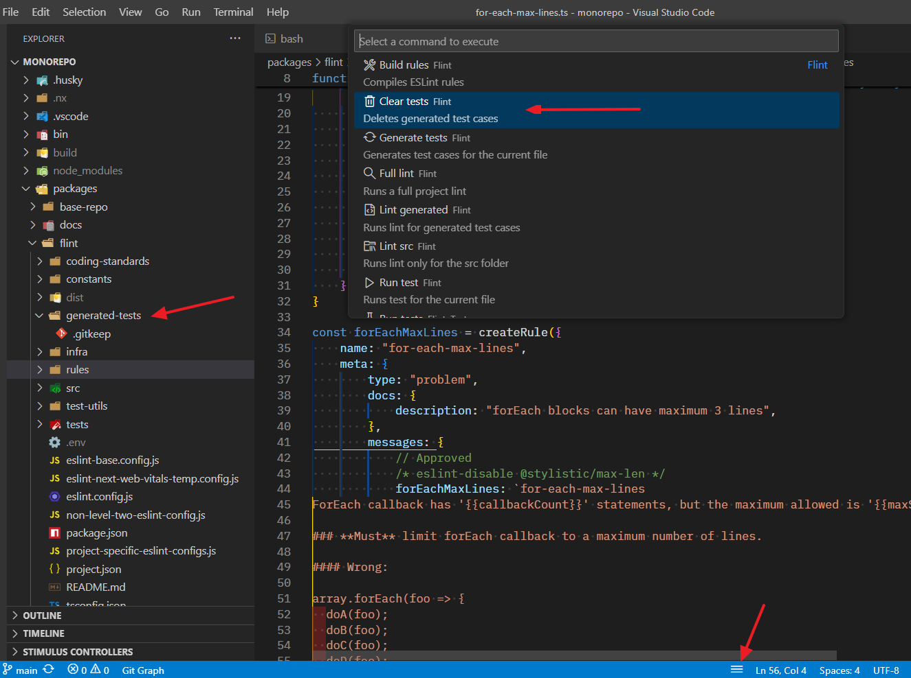

-   **After this, run the linter with the new rule against the entire codebase to identify any errors it might find:**

    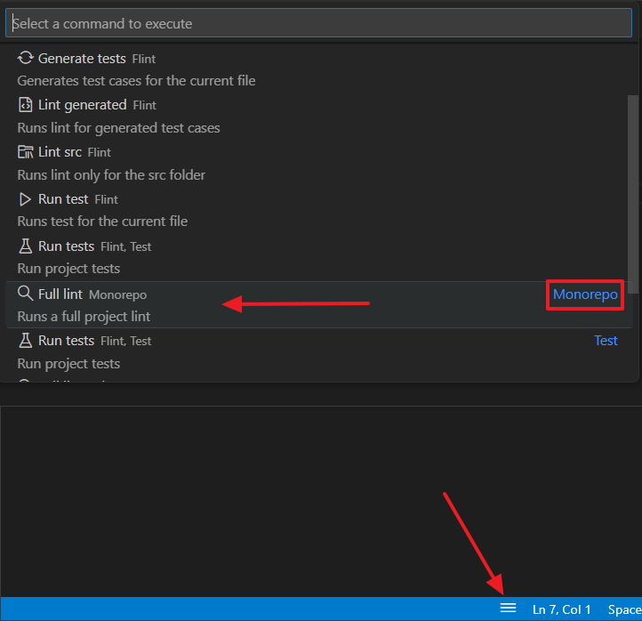

-   > ⚠️ **But before executing this command for the first time, please ensure that your configuration is set up correctly. It should look like this:**

    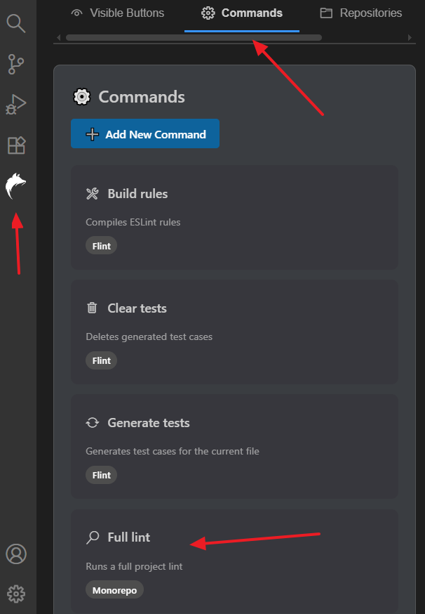

    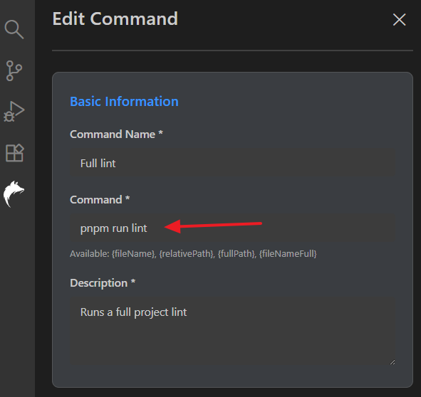

    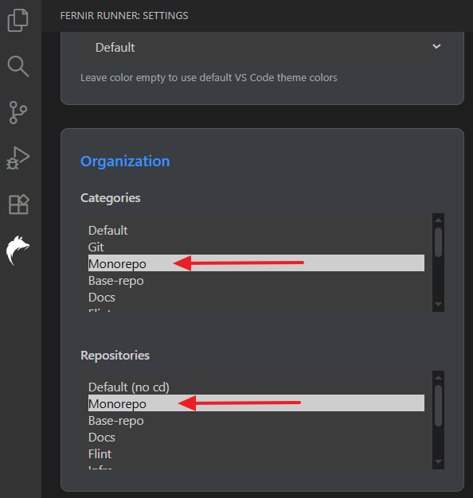

-   > ⚠️ **If your configuration looks different, configure the extension as shown above and save it:**

    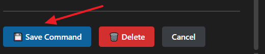

-   **All these commands can be viewed in more detail in the extension itself:**

    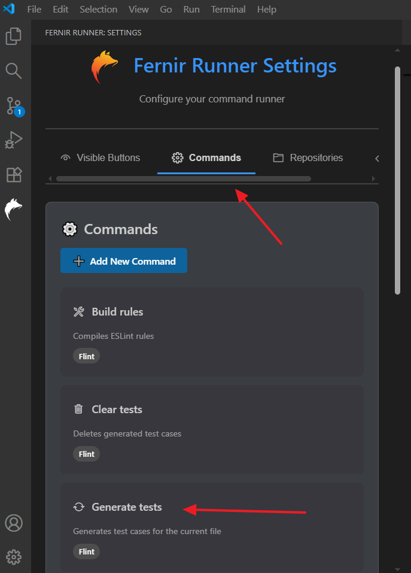

    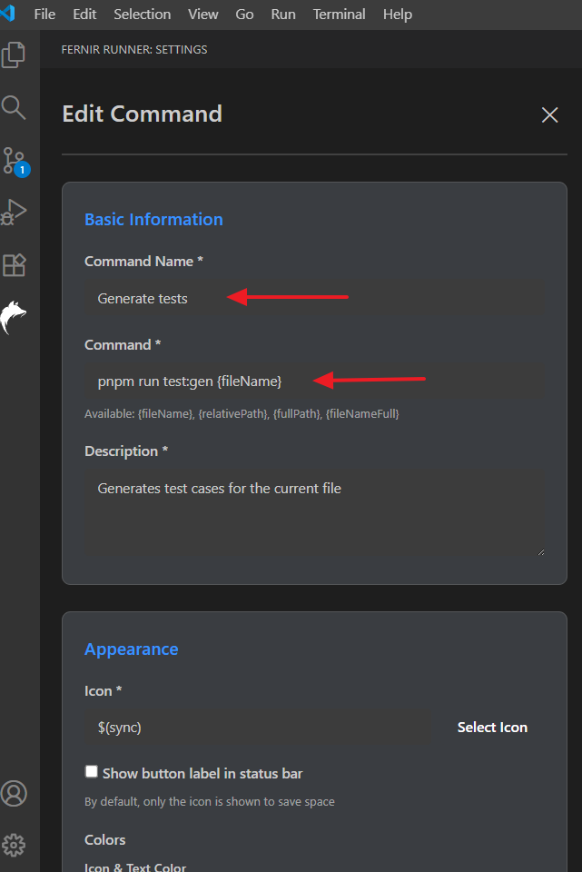

-   **Or in the specific `package.json` file, from where you can run all these commands directly without the extension:**

    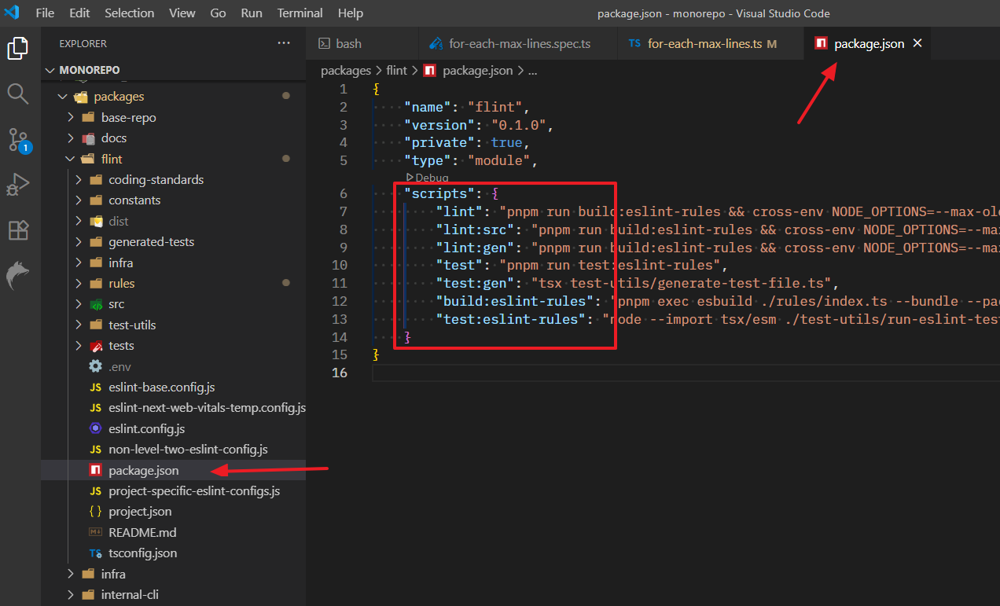

    ***

---

[⬅️ **git-commands**](../git-commands/git-commands.md) • [**content**](../README.md) • [**full-development-flow** ➡️](../full-development-flow/full-development-flow.md)
