[⬅️ **git-conflict-resolution**](../git/git.md) • [**content**](../README.md) • [**git-commands** ➡️](../git-commands/git-commands.md)

---

# Edit commits - Guide

This article covers the basic rules for working with commits. Before you begin, please ensure you have completed the [first-task](../first-task/first-task.md) guide.

### 1. Create and take the task

Create a new task and a merge request (MR) as described [here](../first-task/first-task.md).

-   Name the task "Handling commits" and set the description to "Studying to working with commits".
-   Assign yourself and set the labels to `p9` and `in-progress`.

For the MR:

-   Set the title to match the branch name.
-   Assign yourself.
-   Set the reviewer to Vova Pe.
-   Set the label to `p9`.
-   Check the "Squash commits when merge request is accepted" box.

Now, copy the branch name and open VS Code!

### 2. Working with --amend

We have one key rule when working with commits: for every ac3 (`action-required3`), you must have only one commit. However, sometimes you may need to create more than one commit, for example, when you need to switch branches. So, what should you do in that situation?

Let's create a new file in dev-tutorials/playground folder, named "working-with-commits.ts". Now add the following comment:

```
// First commit.
```

Commit it with using this commands you should know them from [this guide](../first-task/first-task.md):

-   `git add .`
-   `git commit -m "my first commit"`
-   `git log` - display commit history.

After all actions you should have something like this:

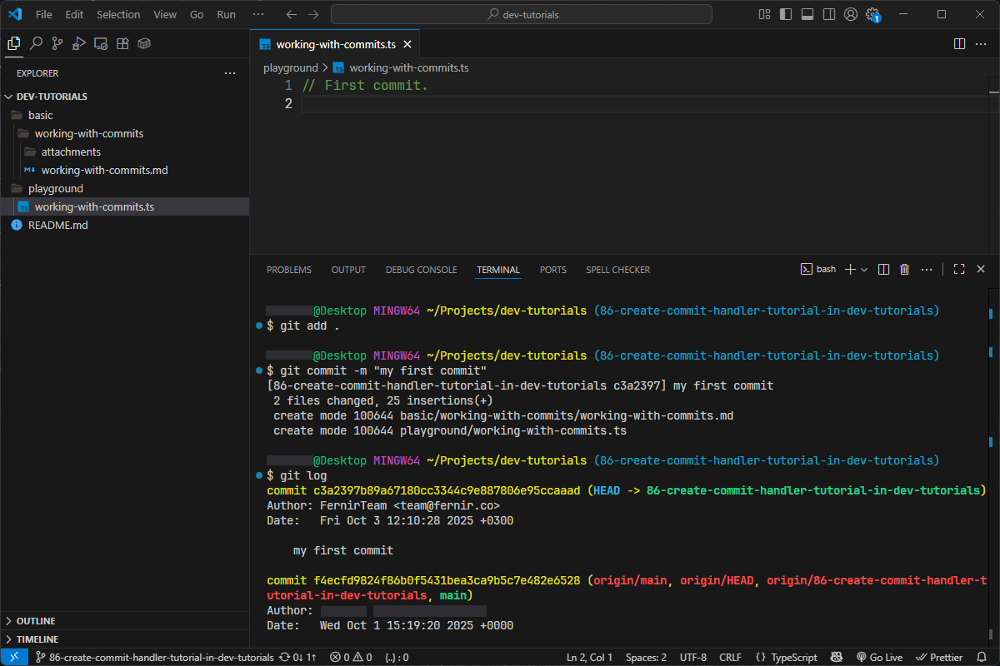

Currently, we have one commit. But what if we make further changes that also need to be committed?
Let's make these changes. Add a new comment to your file:

```
// First commit.

// Second commit.
```

To add these changes to our first commit, you should use the following command:

-   `git add .` - stage your changes.
-   `git commit --amend --no-edit` - add your staged changes to your last commit. The --no-edit parameter means that you don't want to change the commit message.
-   `git log`

It should look like this:

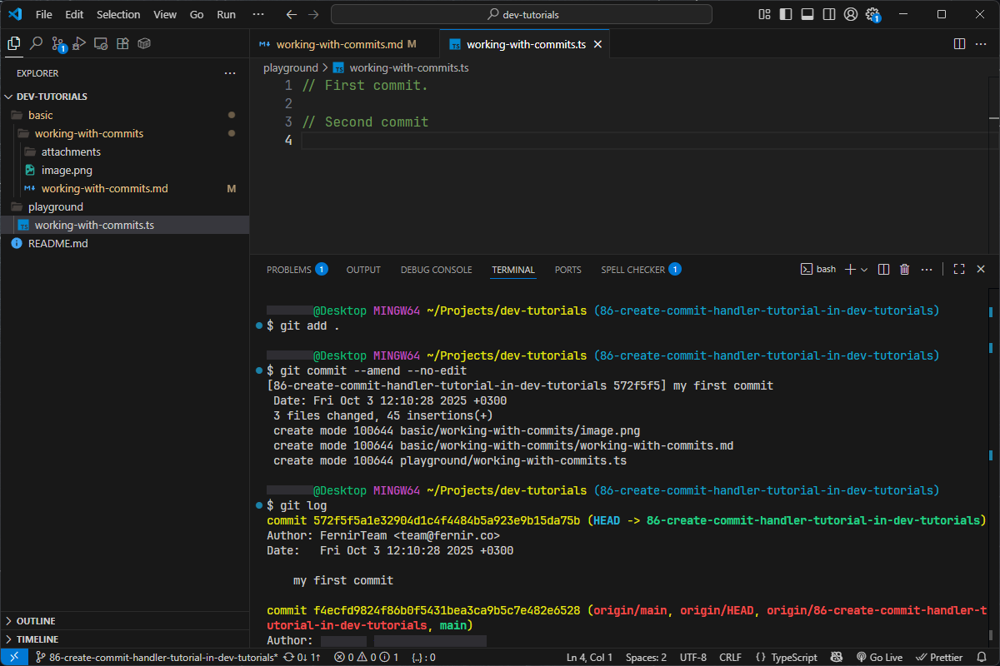

As you can see we have only one commit.

### 4. Working with git rebase

Let's create a third commit, just as we did the first time:

```
// First commit.

// Second commit.

// Third commit.
```

-   `git add .`
-   `git commit -m "my third commit"`
-   `git log --oneline` - display commit history in shorter form.

As you can see, we now have two commits. So, how can we combine them?
Let's use the following command:

`git rebase -i HEAD~2` - 2 number means that we will work only with two last commits.

After executing this command, your default text editor will open. You will see something like this:

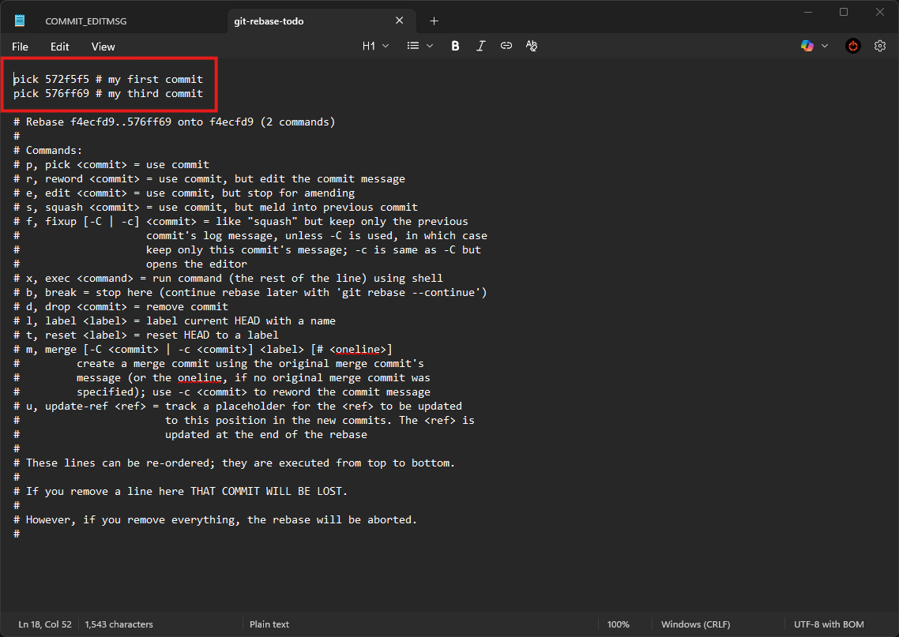

In reality, you only need to focus on the first two lines to combine the commits. The text below them is a short guide explaining the available commands. To combine them, you need to change the pick option to squash for the second commit, as shown in the screenshot:

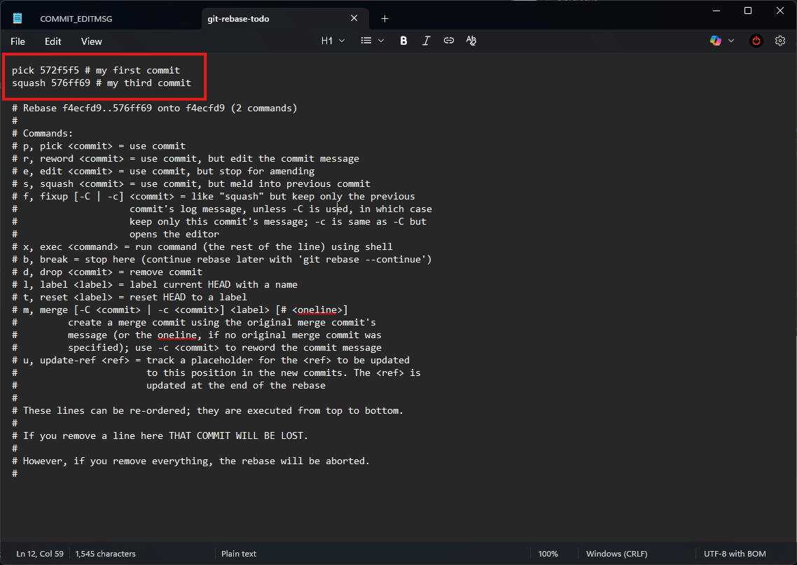

Next, you need to press Ctrl+S to save the file and then close it. On Windows, you can use the shortcut Ctrl+W to close the text editor window.
After that, a new editor window will appear where you can edit the commit message. Lines that start with a # will be ignored.

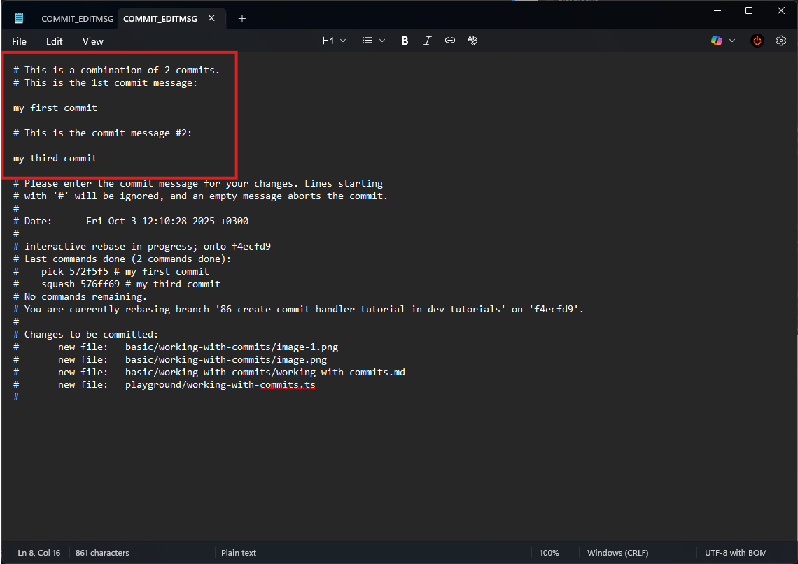

Let's delete the first commit message and leave only the third commit message, like this:

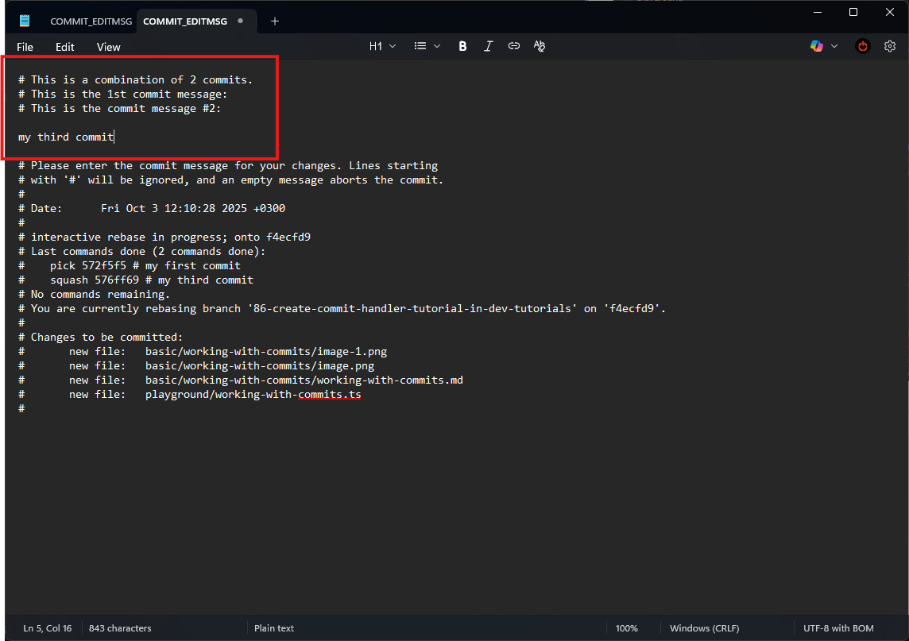

When you have finished editing your commit message, simply close the text editor. If you have done everything correctly, you will see a success message.

```
git log --oneline
```

You will see only one commit like in the screenshot.

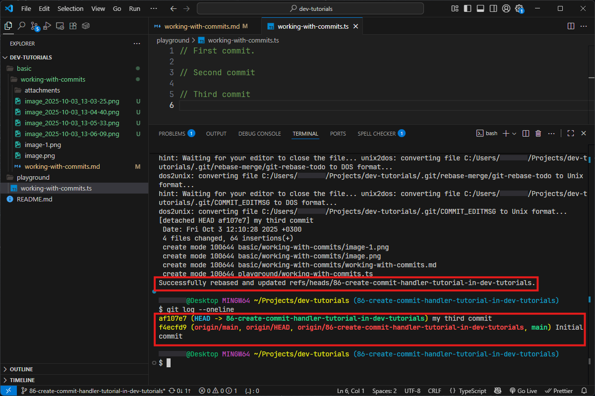

So, what does rebase actually do? In short, it rewrites your commit history. It takes the commits from your current branch and re-applies them on top of the latest version of another branch (usually the main branch). This process creates a clean, linear history, making it look as if you started your work after all the recent changes were already there.
Let's simulate a common situation. Imagine you are working on a task and already have one commit for some reason. For example, perhaps you needed to switch to a different branch for another task, so you committed your changes. Now, when you return to your task and branch, you realize the main branch has been updated, and you need to merge those new changes into your branch. After the merge, you finish your task and make your final commit.
Now, your commit history looks something like this:

-   finished commit
-   merge commit
-   staged changes commit

How can we combine our new commit with the existing ones from the main branch while avoiding a messy merge commit? First, let's simulate this situation in your IDE. We currently have one commit on our branch - my third commit.

Run the following command to merge another branch into yours:

> 💡 Replace `<index>` with your actual task number

`git merge origin/<index>-working-with-commits-example-branch --allow-unrelated-histories`

The --allow-unrelated-histories flag explicitly permits Git to merge branches that do not share a common ancestor.

A new window will open where you can edit the commit message. If you don't want to change the message, simply close the window.

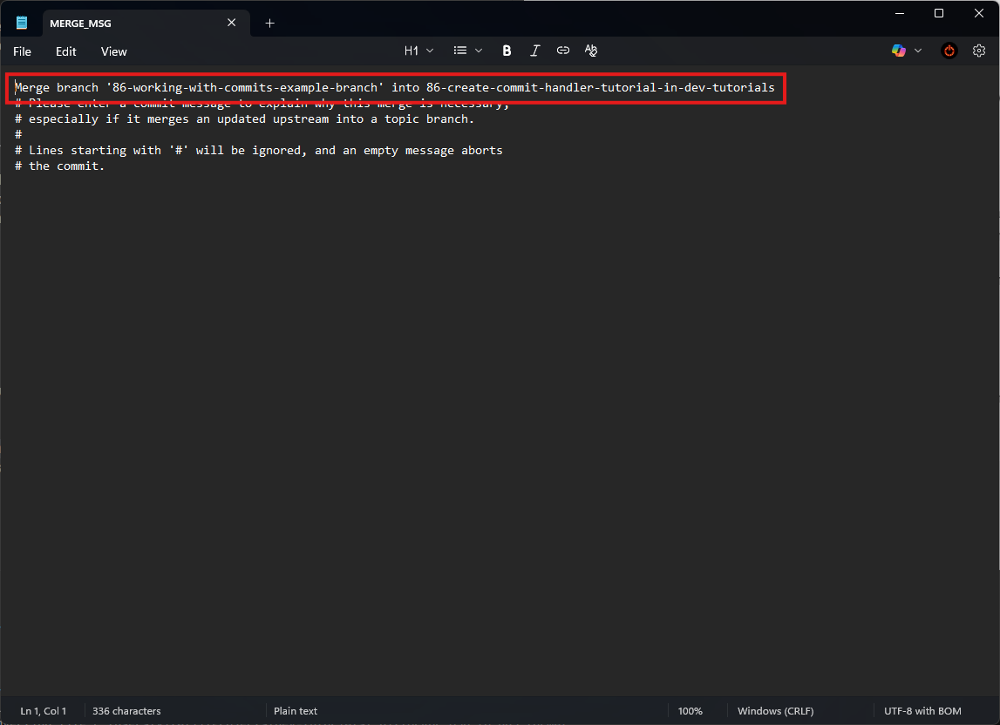

Okay, now execute this:

```
git log --oneline
```

You will now see more than two commits. Why is that? It's because the merge operation has brought in all the commits from the other branch to your history, along with a new merge commit to tie them together.

```
git log --oneline --graph
```

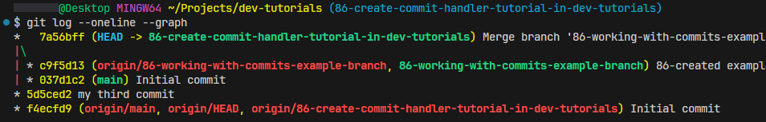

Now you can see that you have only two commits. The red nodes represent your commit history, while the green node represents the commits inside the merge commit. Let's create a new commit. Add a new comment to your file. Now, your file should look like this:

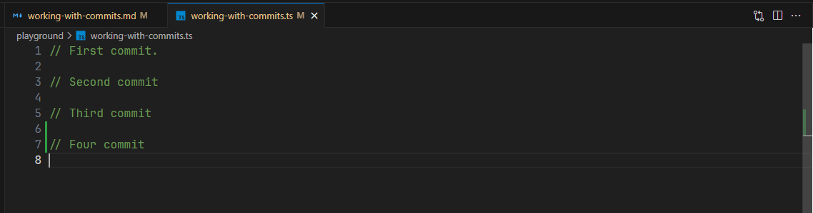

Now create a new commit with this name: "my fourth commit":

`git add .`
`git commit -m "my fourth commit"`
`git log --oneline --graph`

As you can see, now we have history like this:

-   my fourth commit
-   merge commit
-   my third commit

Before push our changes we need to unite "my fourth commit" and "my third commit".
To do it use rebase:

```
git rebase -i HEAD~3
```

The text editor will open. You will see this:

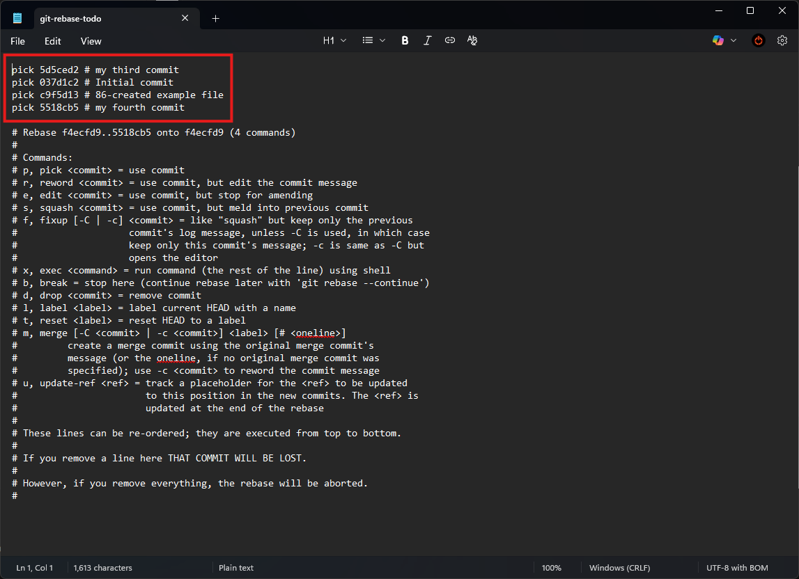

You need to move your third commit before the fourth. And set the fourth commit to squash.

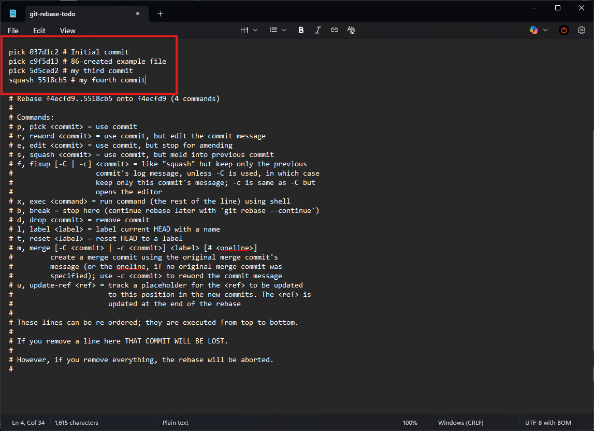

You might get this message. It's not common, and you probably won't come across it often. But now I have two identical initial commits in my history, so I need to choose one. As it's written in the message, run this command:

```
git rebase --skip
```

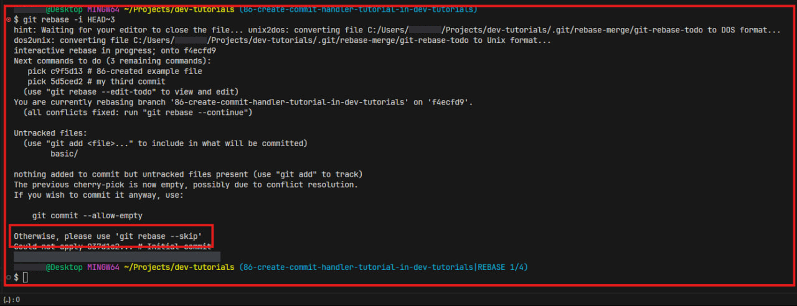

Then you will see a standard window where you can change the commit message.

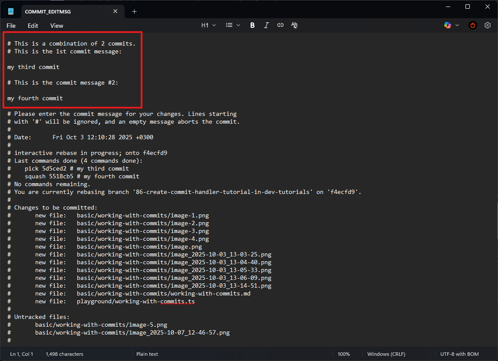

Let's name this commit as "united commit":

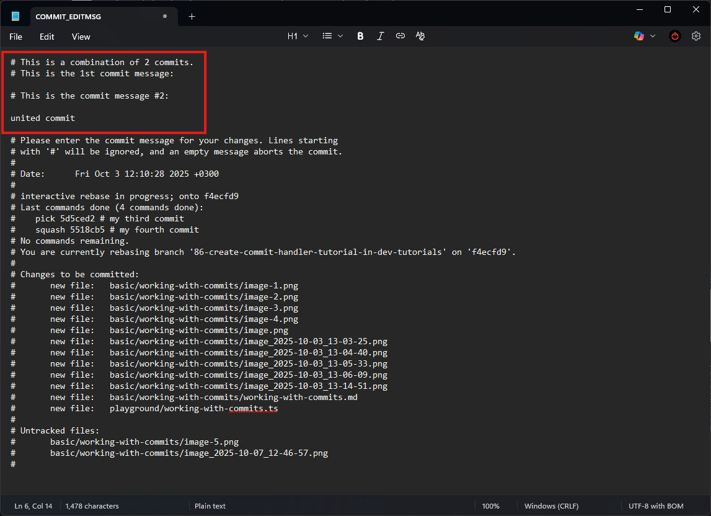

Then close it and execute:

```
git log --oneline --graph
```

As you can see our rebase is finished and maybe we are now left with our single commit, and our merge commit just disappeared because we have brought our commits to the forefront of commits history.

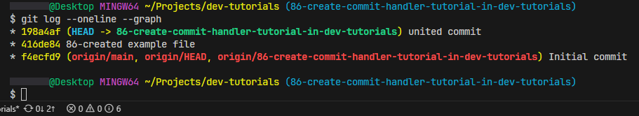

### Cleaning

Now close your mr and delete your task like we did it [here](../first-task/first-task.md).

---

[⬅️ **git-conflict-resolution**](../git/git.md) • [**content**](../README.md) • [**git-commands** ➡️](../git-commands/git-commands.md)
